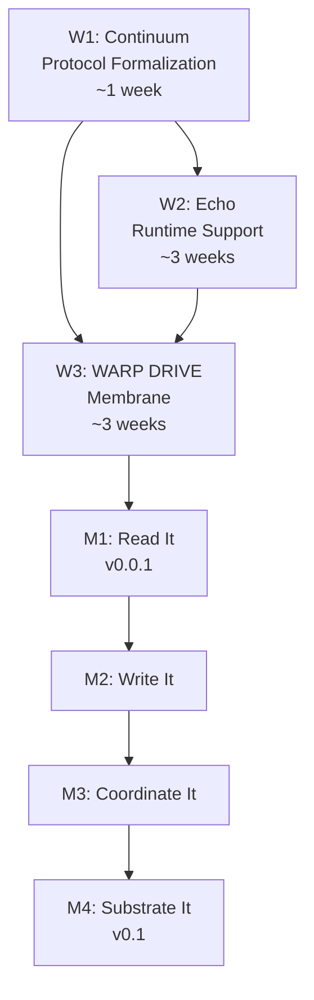
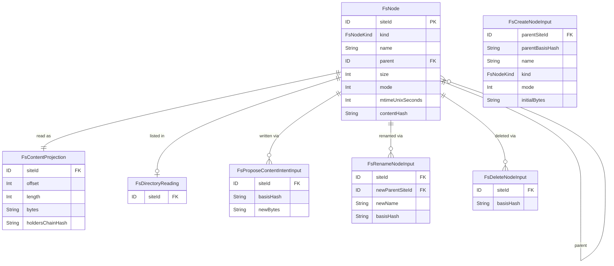
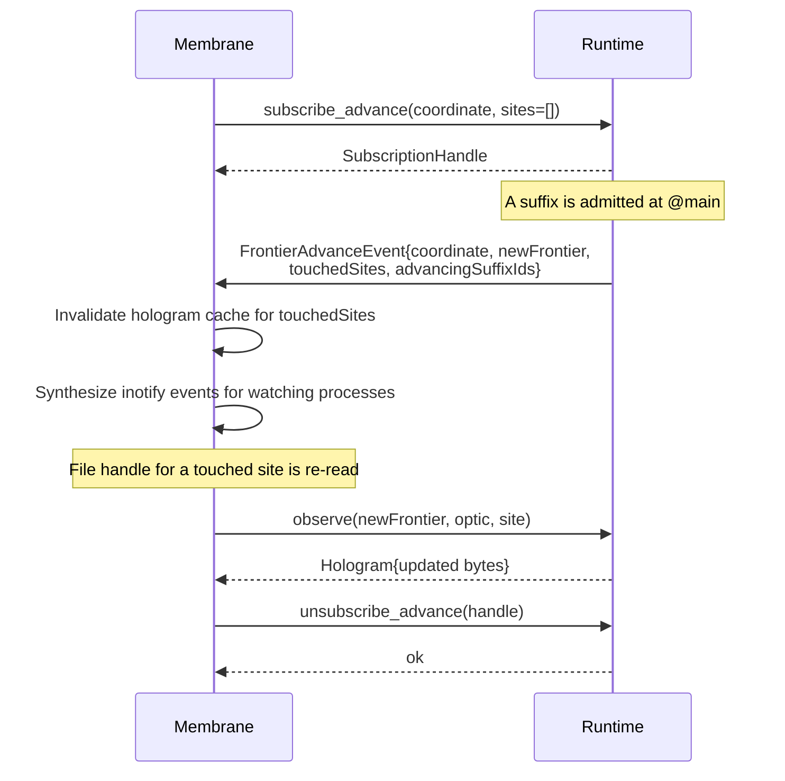
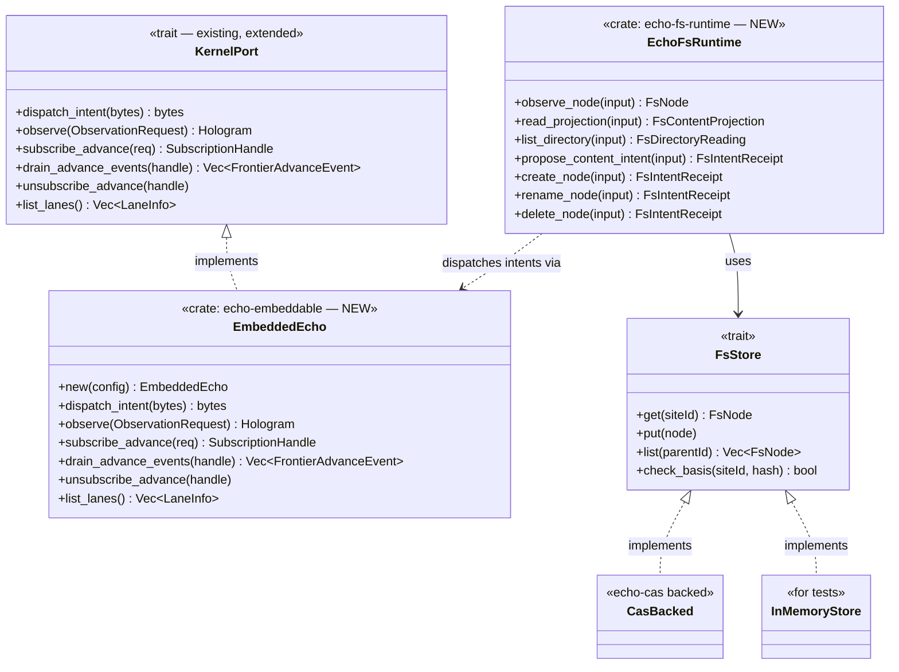
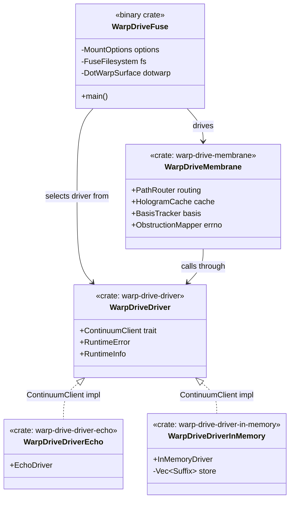
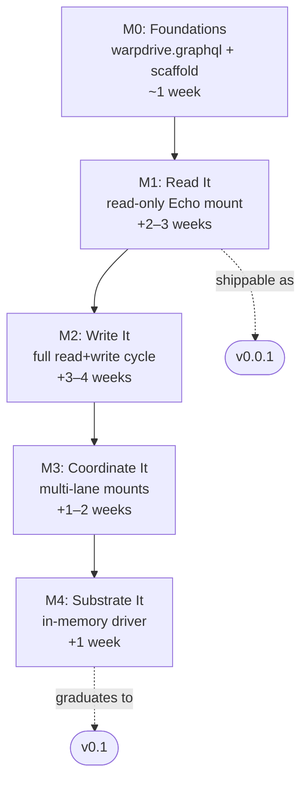
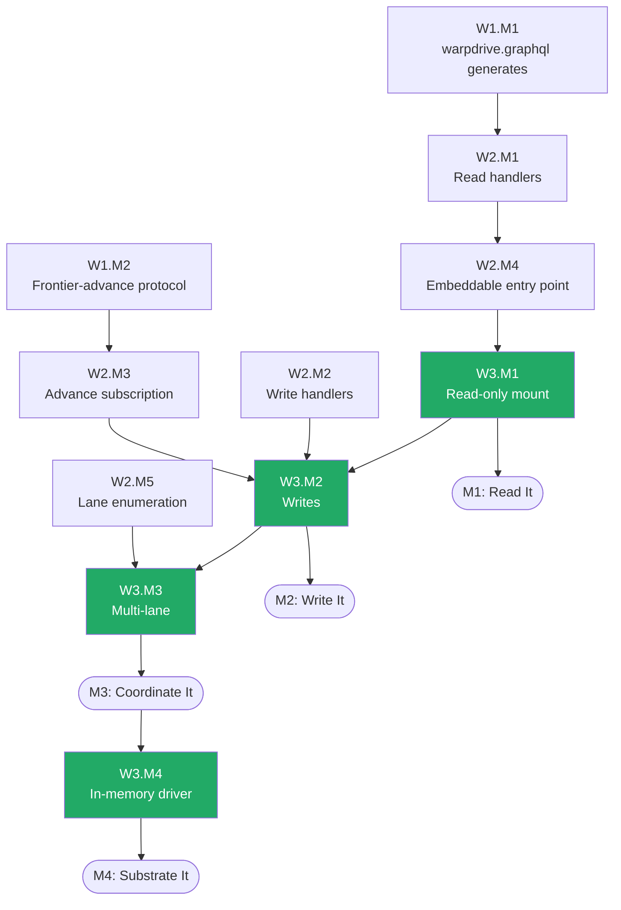
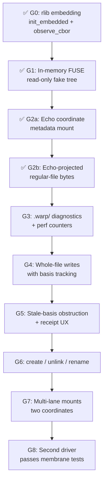

<!-- SPDX-License-Identifier: Apache-2.0 OR LicenseRef-MIND-UCAL-1.0 -->
<!-- © James Ross Ω FLYING•ROBOTS <https://github.com/flyingrobots> -->

# WARP DRIVE — Implementation plan (v0.0.1 → v0.1)

> An operational plan for building WARP DRIVE plus the matching changes
> required in Echo and the (currently conceptual) Continuum protocol layer.
>
> This is the companion to [`TECHNICAL_DEEP_DIVE.md`](TECHNICAL_DEEP_DIVE.md).
> The deep dive answers "what is it." This document answers "how do we
> ship it, in what order, with what scope."

---

## Table of contents

1. [Frame](#1-frame)
2. [Three workstreams at a glance](#2-three-workstreams-at-a-glance)
3. [Workstream 1 — Continuum protocol formalization](#3-workstream-1--continuum-protocol-formalization)
4. [Workstream 2 — Echo runtime support](#4-workstream-2--echo-runtime-support)
5. [Workstream 3 — WARP DRIVE membrane](#5-workstream-3--warp-drive-membrane)
6. [End-to-end milestones](#6-end-to-end-milestones)
7. [Critical path](#7-critical-path)
8. [Risks](#8-risks)
9. [Decisions needed before starting](#9-decisions-needed-before-starting)
10. [Audit of what already exists](#10-audit-of-what-already-exists)
11. [Post-review additions](#11-post-review-additions)

---

## 1. Frame

We are building three things that depend on each other:

- **WARP DRIVE** — the POSIX⇄causal membrane. A FUSE binary that translates
  filesystem operations into Continuum messages and back.
- **Echo runtime support** — the missing pieces in Echo that the membrane
  needs (file-tree schema, frontier-advance subscription, embeddable
  surface, lane enumeration).
- **Continuum protocol formalization** — pulling the protocol that
  currently lives implicitly inside `echo-wasm-abi` into a named,
  documented surface that other runtimes could implement.

The goal of v0.0.1 is a **read-only mount of a single coordinate against
an embedded Echo runtime**, with `vim`, `cat`, `ls`, and `ripgrep` all
working honestly against it. That's the milestone where the architecture
goes from "described" to "demonstrated."

v0.1 adds writes, multi-lane mounts, and at least one second runtime
driver (the in-memory dev runtime, for tests). That's the milestone where
the substrate-agnostic claim from the deep dive becomes empirically true.

Everything past v0.1 (build-artifact projections, time-travel debugging,
agent collaboration UX, performance) is out of scope for this plan.

---

## 2. Three workstreams at a glance

| Workstream | What it produces | Estimated scope | Blocks |
|---|---|---|---|
| **W1 Continuum** | Schema + message families + spec doc | ~1 week of doc + schema work | W2, W3 |
| **W2 Echo runtime** | File-tree contract, frontier subscription, embeddable entry | ~3 weeks (one cycle for each of the three) | W3 (read path), W3 (writes), W3 (multi-mount) |
| **W3 WARP DRIVE** | FUSE binary, driver trait, Echo driver, cache | ~3 weeks across four steps | end-to-end demo |



> **Execution note:** The gate model in [§11.1](#11-post-review-additions)
> controls actual build order. The workstreams below describe ownership and
> scope of deliverables only. **Do not start W1.M1 before G0 passes.**

Total elapsed: ~6-8 weeks for the v0.0.1 → v0.1 trajectory if one person
works it end-to-end. Parallelizable across W1+W2 and W2+W3 with two
people; W1 has to finish before either consumer can lock interfaces.

---

## 3. Workstream 1 — Continuum protocol formalization

### 3.1 Why

Today there is no Continuum crate, no Continuum schema, and no Continuum
spec document. There is `echo-wasm-abi` which holds the wire format
(EINT envelopes, LE binary codec, `KernelPort` trait shapes) and the
de-facto protocol that `warp-wasm` exports.

For WARP DRIVE to legitimately claim substrate independence, Continuum
must be:

- **Specified**, separate from any single runtime's implementation
- **Schema-driven**, with at least one canonical contract (the WARP DRIVE
  filesystem contract) defined as Wesley SDL
- **Documented**, with message families enumerated and stability rules
  stated

The protocol doesn't need a new crate yet — it can live as documentation
plus a Wesley schema. The crate split comes later if/when a non-Echo
runtime starts implementing it.

### 3.2 What gets defined

Three deliverables:

#### 3.2.1 The WARP DRIVE filesystem contract (`warpdrive.graphql`)

The Wesley schema that any Continuum runtime must implement to host a
WARP DRIVE mount. Sketch:

```graphql
"""
A node in a virtual filesystem tree as projected by a Continuum runtime.
Sites are addressed by stable opaque ids, not paths. The membrane
maintains the path↔site translation.
"""
type FsNode {
    siteId: ID!
    kind: FsNodeKind!
    name: String!
    parent: ID
    size: Int
    mode: Int!
    mtimeUnixSeconds: Int!
    contentHash: String   # null for directories
}

enum FsNodeKind {
    FILE
    DIRECTORY
    SYMLINK
}

input FsObserveNodeInput {
    siteId: ID!
}

input FsReadProjectionInput {
    siteId: ID!
    offset: Int!
    length: Int!
}

input FsListDirectoryInput {
    siteId: ID!
}

type FsContentProjection {
    siteId: ID!
    offset: Int!
    length: Int!
    bytes: String!  # base64 in JSON; raw bytes in LE binary
    holdersChainHash: String!  # opaque basis token for write-back
}

type FsDirectoryReading {
    siteId: ID!
    entries: [FsNode!]!
}

input FsProposeContentIntentInput {
    siteId: ID!
    basisHash: String!     # holdersChainHash from a prior read
    newBytes: String!
}

input FsCreateNodeInput {
    parentSiteId: ID!
    parentBasisHash: String!   # basis of the parent directory at observe time
    name: String!
    kind: FsNodeKind!
    mode: Int!
    initialBytes: String       # for FILE
}

input FsRenameNodeInput {
    siteId: ID!
    newParentSiteId: ID!
    newName: String!
    basisHash: String!
}

input FsDeleteNodeInput {
    siteId: ID!
    basisHash: String!
}

type Query {
    fsObserveNode(input: FsObserveNodeInput!): FsNode!
        @wes_op(name: "fsObserveNode")
    fsReadProjection(input: FsReadProjectionInput!): FsContentProjection!
        @wes_op(name: "fsReadProjection")
    """
    Convenience operation: semantically an observe call with a directory
    aperture. Not a directory-tree primitive — the runtime projects
    membership; the membrane owns path translation.
    """
    fsListDirectory(input: FsListDirectoryInput!): FsDirectoryReading!
        @wes_op(name: "fsListDirectory")
}

enum FsObstructionReason {
    STALE_BASIS
    CONCURRENT_CONFLICT
    DEFERRED_ADMISSION
    POLICY_DENIAL
    BUDGET_EXHAUSTED
    MISSING_EVIDENCE
    COORDINATE_GONE
    NOT_IMPLEMENTED
    NO_SUCH_SITE
    INVALID_DELTA
}

enum IntentOutcome {
    ADMITTED
    OBSTRUCTED
    DEFERRED
    DENIED
}

"""
The runtime's response to a mutation intent. Carries the outcome and,
on success, the new projection. On obstruction, carries the typed reason
and recovery hint — same shape as a receipt in /.warp/intents/<id>.
"""
type FsIntentReceipt {
    intentId: ID!
    outcome: IntentOutcome!
    reason: FsObstructionReason  # present when outcome != ADMITTED
    newProjection: FsContentProjection  # populated when outcome == ADMITTED
    recovery: String             # recovery hint
}

type Mutation {
    fsProposeContentIntent(input: FsProposeContentIntentInput!): FsIntentReceipt!
        @wes_op(name: "fsProposeContentIntent")
    fsCreateNode(input: FsCreateNodeInput!): FsIntentReceipt!
        @wes_op(name: "fsCreateNode")
    fsRenameNode(input: FsRenameNodeInput!): FsIntentReceipt!
        @wes_op(name: "fsRenameNode")
    fsDeleteNode(input: FsDeleteNodeInput!): FsIntentReceipt!
        @wes_op(name: "fsDeleteNode")
}
```

Notes:

- **Sites, not paths.** The membrane maintains path↔siteId mapping in
  user space. The runtime never sees a path.
- **basisHash on every mutation.** This is the WARP basis discipline at
  the wire level — writes that don't carry a basis are not lawful.
- **`holdersChainHash` on every reading.** Opaque to the membrane; the
  runtime uses it to verify basis on next write.



This schema goes through the existing Wesley pipeline. `echo-wesley-gen`
emits Rust handlers; `wesley emit le-binary-typescript` emits TS codecs
(though the membrane is Rust, the TS emit is useful for any future
web-side WARP DRIVE viewer). The OP_* constants generated from this
schema become the EINT op ids the membrane sends.

#### 3.2.2 Frontier-advance subscription protocol

A new message family for the runtime to push events to the membrane.
Sketch (in pseudo-Wesley):

```text
SubscribeFrontierAdvance {
    coordinate: Coordinate!     # which lane to watch
    sites: [ID!]                # optional: filter to these sites
}

FrontierAdvanceEvent {
    coordinate: Coordinate!
    newFrontier: ID!
    touchedSites: [ID!]!        # sites whose projection MAY have changed
    advancingSuffixIds: [ID!]!  # the suffixes that caused the advance
}
```

This is the cache-invalidation channel for the membrane and the input
channel for `inotify` synthesis. It needs to be specified as part of
Continuum because non-Echo runtimes will need to implement it (or
declare they don't, and accept TTL fallback).



#### 3.2.3 Continuum spec document

A document, not a crate. Lives at `echo/docs/spec/continuum-v1.md` for
now (will likely move to its own repo when there's a non-Echo
implementer). Contents:

- Wire format reference (points to `echo-wasm-abi::codec` and EINT)
- Message family registry (the schemas like `warpdrive.graphql` are
  registered here)
- The frontier-advance subscription protocol
- Capability model
- Versioning rules (what's a breaking change, what's additive)
- Conformance checklist

About 500-800 lines of doc, mostly cross-referencing existing Echo
internals plus the new protocol additions.

### 3.3 Scope estimate

| Deliverable               | Scope                                            |
| ------------------------- | ------------------------------------------------ |
| `warpdrive.graphql`       | ~150 lines schema + first-pass Wesley generation |
| Frontier-advance protocol | Schema additions + 200-line spec section         |
| Continuum spec doc        | 500-800 lines                                    |
| **Total**                 | **~1 week** for one person familiar with Echo    |

### 3.4 Where it lives

Initially in **echo/**:

- `echo/docs/spec/continuum-v1.md`
- `echo/contracts/continuum/warpdrive.graphql`

Later, if a non-Echo runtime starts implementing Continuum, extract to a
dedicated `continuum-spec` repo. That extraction is cheap because the
docs and schemas are self-contained.

### 3.5 Milestones

- **W1.M1**: `warpdrive.graphql` written and successfully generates Rust
  and TS via existing Wesley pipeline
- **W1.M2**: Frontier-advance subscription protocol specified
- **W1.M3**: `continuum-v1.md` spec document complete

---

## 4. Workstream 2 — Echo runtime support

### 4.1 Why

Echo today is shaped for jedit's needs: a single worldline per buffer,
the rope text contract, scheduler-driven admission. WARP DRIVE needs
some new things and some things made more general:

- **A handler implementation for the WARP DRIVE filesystem contract.**
  Echo today knows about the rope. It does not know about files. The
  handler implementation is new code that lives somewhere in
  `crates/echo-app-core` or a new `crates/echo-fs-runtime` crate.
- **Frontier-advance event subscription.** Echo's scheduler has
  `RunCompletion` events but no general subscription. Needs adding.
- **An embeddable entry point.** ✅ **Done at G0.** `warp-wasm` embeds
  as a native Rust rlib. `init_embedded()` initializes the engine kernel;
  `observe_cbor()` round-trips observe requests. No wasm runtime host
  needed.
- **Lane enumeration.** Echo has worldlines; "lanes" as named
  collections of worldlines aren't explicit. The membrane needs to ask
  "what lanes do you expose?" and get back a list.

### 4.2 Deliverables

#### 4.2.1 Filesystem contract handler implementation

A new crate or module that implements the handlers for
`warpdrive.graphql`. It needs a backing store; the obvious choice is
the existing `echo-cas` crate (content-addressed storage).

```text
crates/echo-fs-runtime/
├── Cargo.toml
├── src/
│   ├── lib.rs
│   ├── handlers/
│   │   ├── observe.rs        # fsObserveNode, fsReadProjection, fsListDirectory
│   │   └── mutate.rs         # fsProposeContentIntent, fsCreateNode, fsRenameNode, fsDeleteNode
│   ├── store/
│   │   ├── mod.rs            # generic FsStore trait
│   │   ├── cas_backed.rs     # echo-cas-backed implementation
│   │   └── in_memory.rs      # for tests
│   └── basis.rs              # basis token computation (holdersChainHash)
└── tests/
    ├── observe.rs
    ├── mutate_basis_stale.rs
    └── mutate_create_and_list.rs
```

Scope: ~2000-3000 lines of Rust, including tests. The basis discipline
(every write checks basisHash against current holders chain) is the
hardest part — it's the same problem as jedit's session-staleness check
but at the file level.

#### 4.2.2 Frontier-advance subscription

In `crates/echo-wasm-abi/src/kernel_port.rs`, add to `KernelPort`:

```rust
pub trait KernelPort {
    // ... existing methods ...

    /// Subscribe to frontier-advance events for the given coordinates.
    /// Returns a handle that the host calls drain_advance_events() on.
    fn subscribe_advance(
        &mut self,
        request: SubscribeAdvanceRequest,
    ) -> Result<SubscriptionHandle, AbiError>;

    /// Drain pending advance events for a subscription. Non-blocking;
    /// the host is responsible for calling this on a cadence (likely
    /// after each scheduler tick).
    fn drain_advance_events(
        &mut self,
        handle: SubscriptionHandle,
    ) -> Result<Vec<FrontierAdvanceEvent>, AbiError>;

    /// Drop a subscription.
    fn unsubscribe_advance(
        &mut self,
        handle: SubscriptionHandle,
    ) -> Result<(), AbiError>;
}
```

In `warp-wasm`, add three matching exports:
`subscribe_advance_cbor`, `drain_advance_events_cbor`,
`unsubscribe_advance_cbor` (or whatever the naming convention becomes
after the warp-wasm CBOR cleanup — see echo bad-code card
`PLATFORM_warp-wasm-cbor-debt.md`).

In the scheduler (`warp-core`), wire the existing `RunCompletion` /
admission codepath to emit per-suffix advance events to all matching
subscriptions.

Scope: ~600-900 lines including tests. The subscription bookkeeping is
finicky (subscriptions are per-mount, per-coordinate; they need to
survive scheduler restarts; they need GC when the host disconnects).

#### 4.2.3 Embeddable entry point ✅ Done at G0

`warp-wasm` links directly as a native Rust rlib — no wasm runtime host
required. The two entry points proved in the G0 spike:

```rust
// Creates and installs the engine kernel; returns worldline id + initial head.
pub fn init_embedded() -> InitResult;

// Round-trips an ObservationRequest encoded as CBOR bytes.
pub fn observe_cbor(request_bytes: &[u8]) -> Vec<u8>;
```

A thin `echo-embeddable` wrapper exposes a `KernelPort`-compatible
surface to the rest of the FUSE binary:

```text
crates/echo-embeddable/
├── Cargo.toml
├── src/
│   ├── lib.rs
│   ├── client.rs         # KernelPort impl over rlib calls
│   └── lifecycle.rs      # init / shutdown
└── tests/
    └── load_and_observe.rs
```

```rust
pub struct EmbeddedEcho { /* rlib state handle */ }

impl EmbeddedEcho {
    pub fn new(config: EmbeddedEchoConfig) -> Result<Self, EmbedError>;

    pub fn dispatch_intent(&mut self, eint_bytes: &[u8]) -> Result<Vec<u8>, AbiError>;
    pub fn observe(&self, request: ObservationRequest) -> Result<Hologram, AbiError>;
    pub fn subscribe_advance(&mut self, req: SubscribeAdvanceRequest) -> Result<SubscriptionHandle, AbiError>;
    // ... etc
}
```

Each call serializes to CBOR, invokes the rlib function, and deserializes.
No serialization round-trip across a wasm boundary; no host shim layer.

Scope: ~300-400 lines — substantially simpler than the wasmtime approach
originally scoped.



#### 4.2.4 Lane enumeration

Smallest deliverable. Add to `KernelPort`:

```rust
fn list_lanes(&self) -> Result<Vec<LaneInfo>, AbiError>;
```

In Echo today, lanes are implicit — created on first reference. For
WARP DRIVE we need explicit lane records. Probably lives in
`echo-app-core` as a lane registry. Existing worldlines map to lanes
1-to-1 for now; later, lanes may contain multiple worldlines.

Scope: ~300 lines.

### 4.3 Scope estimate

| Deliverable | Scope |
|---|---|
| Filesystem contract handlers | ~3000 lines, ~1.5 weeks |
| Frontier-advance subscription | ~800 lines, ~3-4 days |
| Embeddable entry point | ✅ ~300 lines (rlib wrapper, G0 done) |
| Lane enumeration | ~300 lines, ~1 day |
| **Total** | **~3 weeks** for one person |

### 4.4 Where it lives

All in **echo/**. The filesystem runtime is new; the others are extensions
to existing crates plus one new wrapper crate.

### 4.5 Milestones

- **W2.M1**: `echo-fs-runtime` handlers passing tests for read path
  (observe-node, observe-content, list-directory)
- **W2.M2**: `echo-fs-runtime` handlers passing tests for write path
  (write-content with basis check, create-node, rename, delete)
- **W2.M3**: Frontier-advance subscription wired through scheduler with
  tests
- **W2.M4**: `echo-embeddable` loads warp-wasm and round-trips an
  observe call
- **W2.M5**: Lane enumeration returns useful data

---

## 5. Workstream 3 — WARP DRIVE membrane

### 5.1 Why

This is the actual product. Everything else exists to support this.

### 5.2 Repo layout

```text
warp-drive/
├── Cargo.toml                    # workspace
├── README.md
├── LICENSE
├── docs/
│   ├── TECHNICAL_DEEP_DIVE.md
│   └── IMPLEMENTATION_PLAN.md    # this file
└── crates/
    ├── warp-drive-membrane/
    │   ├── Cargo.toml
    │   └── src/
    │       ├── lib.rs
    │       ├── routing.rs        # path ↔ coordinate routing
    │       ├── cache.rs          # hologram cache (key from deep dive §6.4)
    │       ├── basis.rs          # per-file-handle basis tracking
    │       └── errno.rs          # runtime obstruction → POSIX errno
    ├── warp-drive-driver/
    │   ├── Cargo.toml
    │   └── src/
    │       ├── lib.rs            # ContinuumClient trait
    │       └── errors.rs
    ├── warp-drive-driver-echo/
    │   ├── Cargo.toml
    │   └── src/
    │       └── lib.rs            # impl ContinuumClient via echo-embeddable
    ├── warp-drive-driver-in-memory/
    │   ├── Cargo.toml
    │   └── src/
    │       └── lib.rs            # impl ContinuumClient with a Vec<Suffix>
    └── warp-drive-fuse/
        ├── Cargo.toml
        └── src/
            ├── main.rs           # binary entrypoint
            ├── mount.rs          # mount option parsing
            ├── fuse_ops.rs       # impl fuser::Filesystem
            └── dotwarp.rs        # /.warp/ synthetic surface
```



### 5.3 Step-by-step deliverables

These map to §12 of the deep dive but with concrete scope.

#### 5.3.1 Step 1 — Read-only mount

What ships: `warp-drive-fuse` binary that mounts a single coordinate
against an embedded Echo runtime, exposes a navigable read-only
directory tree, supports `cat`, `ls`, `find`, `ripgrep`, `vim` (read
mode), `tree`.

Components:

- `warp-drive-driver`: trait definition (see deep dive §14)
- `warp-drive-driver-echo`: impl backed by `echo-embeddable`
- `warp-drive-membrane`: routing + cache (read-only paths)
- `warp-drive-fuse`: FUSE operations for `LOOKUP`, `GETATTR`, `OPEN`,
  `READ`, `RELEASE`, `READDIR`, `READLINK`

Required from W1: `warpdrive.graphql` (for the wire format) and the
Continuum spec sections covering reads.

Required from W2: `echo-fs-runtime` handlers for reads (M2.W1) and
`echo-embeddable` (M2.W4). Lane enumeration not required if we
hardcode the lane in mount options for v0.0.1.

Scope: ~2500-3500 lines in warp-drive. Plus integration with fuser
(macFUSE on macOS, libfuse on Linux).

Exit criteria: mounted Echo runtime, `vim README.md` shows real
content, `rg "TODO" /mnt/warpdrive` works, no crashes after 10
minutes of light browsing.

#### 5.3.2 Step 2 — Write-through with basis tracking

What ships: the same binary now handles writes. `vim :w` works.
Stale-basis writes return `EBUSY` with detail in `/.warp/intents/<id>`.
Package-manager compatibility (npm, pnpm, yarn) begins here but is not
declared supported until G6 verifies create/rename/unlink behavior.

Components added:

- `warp-drive-membrane/basis.rs`: per-file-handle retention of the
  hologram identity at OPEN time; diff at FLUSH time
- `warp-drive-membrane/errno.rs`: full mapping table from deep dive §8
- `warp-drive-fuse/fuse_ops.rs`: `CREATE`, `WRITE`, `FLUSH`, `RELEASE`
  (write-path), `UNLINK`, `RENAME`, `SETATTR` (for permissions/mtime
  where the runtime allows)
- `warp-drive-fuse/dotwarp.rs`: the `/.warp/intents/<id>` synthetic
  files

Required from W1: `warpdrive.graphql` mutation operations finalized,
basis discipline documented in spec

Required from W2: `echo-fs-runtime` write handlers with basis checks
(M2.W2)

Scope: ~2000 lines added.

Exit criteria: vim save, edit, save again works without conflict.
Two concurrent vims on the same file → one wins, the other gets
`EBUSY` with a well-formed receipt under `/.warp/intents/last`.

#### 5.3.3 Step 3 — Multi-lane on the same machine

What ships: two mounts of the same Echo runtime at different
coordinates running simultaneously. Each mount has independent cache
state. Lane enumeration via `/.warp/lanes`.

Components added:

- `warp-drive-membrane/cache.rs`: per-mount cache isolation (already
  enforced by cache key, but lifecycle and memory limits need design)
- `warp-drive-fuse/mount.rs`: mount option for coordinate is
  per-invocation; multiple processes coexist
- Coordination: one `echo-embeddable` instance per mount process
  initially. Later, a daemon (Step 4-adjacent) may share one Echo
  instance across mounts.

Required from W2: lane enumeration (M2.W5)

Scope: ~1000 lines added.

Exit criteria: `mount` twice at different coordinates; cross-mount
`diff` works; advancing one lane does not invalidate the other's
cache.

#### 5.3.4 Step 4 — Pluggable runtimes via Continuum

What ships: the in-memory dev runtime (`warp-drive-driver-in-memory`)
as a second driver. Documentation and tests proving the substrate
swap is real.

Components added:

- `warp-drive-driver-in-memory`: ~500 lines, simplest possible impl
  of `ContinuumClient`
- Integration tests that run the same FUSE-level scenarios against
  both drivers

This step is the validator for the substrate-agnostic claim. If the
Echo driver and the in-memory driver behave the same from the
membrane's perspective, the trait is well-shaped. If not, the trait
needs reshaping until they do.

Required from anyone: nothing new.

Scope: ~800 lines added.

Exit criteria: the same test suite passes against both drivers. The
mount options `runtime=echo` and `runtime=in-memory` are both useful.

### 5.4 Milestones

- **W3.M1**: Read-only mount working end-to-end (Step 1 exit)
- **W3.M2**: Writes working end-to-end (Step 2 exit)
- **W3.M3**: Multi-lane working (Step 3 exit)
- **W3.M4**: Second driver passing same tests (Step 4 exit)

---

## 6. End-to-end milestones

Combining the workstream milestones into shipping moments:

### 6.1 M0 — G-1 / G0 / G1 Falsification (1 week)

Goal: answer the load-bearing unknowns before any protocol ceremony begins.

**G-1 repo hygiene (hours, not days):**

- LICENSE matches all SPDX headers
- Crate and repo naming locked
- README states experimental status

**G0 — embedding spike:** ✅ DONE

- `warp-wasm` embeds as a native Rust rlib — no wasm runtime needed
- `init_embedded()` + `observe_cbor()` round-trip from outside the echo workspace
- See `docs/gates/G0.md` for the full finding

**G1 — in-memory FUSE fake tree:**

- Cargo workspace scaffolded with empty crates
- In-memory driver exposes hardcoded fixture tree (see §11.6)
- `ls`, `cat`, `find`, `rg` all work against it
- `.warp/coordinate`, `.warp/runtime`, `.warp/stats` readable

Shipping value: the POSIX translation layer, inode synthesizer, cache,
and `.warp/` surface are all proven before Echo enters the room. G0
answers the embedding question that everything else depends on.

### 6.2 M1 — "Read it" (2-3 weeks)

Goal: read-only mount, Echo backend, recognizable directory tree.

- W1.M1 ✅, W1.M3 first draft of spec
- W2.M1 (read handlers), W2.M4 (embeddable)
- W3.M1 (read-only mount)

Shipping value: a demo. `vim README.md` against a WARP DRIVE mount,
read the file, see the content, exit. `rg`. `ls`. `tree`. The deep
dive's claims become demonstrable for reads.

### 6.3 M2 — "Write it" (3-4 weeks after M1)

Goal: full read+write cycle, basis-staleness handled correctly.

- W1.M2 (frontier-advance protocol specified)
- W2.M2 (write handlers), W2.M3 (advance subscription)
- W3.M2 (writes)

Shipping value: real editing against a WARP DRIVE mount.
`vim` writes work, `cp` works, stale-basis obstruction works.
Package-manager and `git clone` compatibility begins here but is not
declared supported until G6 verifies create/unlink/rename behavior.

### 6.4 M3 — "Coordinate it" (1-2 weeks after M2)

Goal: multi-lane reality.

- W2.M5 (lane enumeration)
- W3.M3 (multi-lane mounts)

Shipping value: human + agent on adjacent coordinates working
simultaneously. This is the storytelling milestone — the
demoability that justifies the project to non-believers.

### 6.5 M4 — "Substrate it" (1 week after M3)

Goal: prove substrate independence.

- W3.M4 (in-memory driver)

Shipping value: the deep dive's substrate-agnostic claim is no longer
theoretical. Two drivers, same tests, same membrane.

### 6.6 v0.0.1 = M1; v0.1 = M4



M1 is shippable as v0.0.1 if reads alone are interesting (they are, for
demos and historical inspection). The rest of the milestones graduate
toward v0.1.

---

## 7. Critical path

The dependency graph:

```text
W1.M1 (warpdrive.graphql)
  └─→ W2.M1 (read handlers) ─→ W2.M4 (embeddable) ─→ W3.M1 (read mount) ─→ M1
                                                       │
W1.M2 (advance protocol)                               │
  └─→ W2.M3 (subscription) ──────────────────────────┐ │
                                                      ↓ ↓
W2.M2 (write handlers) ─────────────────→ W3.M2 (writes) ─→ M2
                                                       │
W2.M5 (lanes) ────────────────────────→ W3.M3 (multi-lane) ─→ M3
                                                       │
                          W3.M4 (in-memory driver) ─→ M4
```



Critical path to M1: **W1.M1 → W2.M1 → W2.M4 → W3.M1**. This is ~3
weeks if done sequentially, ~2 weeks if W2.M4 can start in parallel
with the second half of W2.M1.

Critical path to v0.1 (M4): ~7 weeks sequential, ~5 weeks with one
parallel worker on W2 and W3.

The biggest schedule risk is W2.M1 (the filesystem handlers) — that's
the place where most of the basis-discipline plumbing lives and where
the test surface is largest.

---

## 8. Risks

The honest list.

### 8.1 ~~Echo isn't ready to be embedded~~ — RESOLVED at G0

**Finding (G0, 2026-05-29):** `warp-wasm` embeds cleanly as an rlib.
`init_embedded()` creates and installs the engine kernel; `observe_cbor()`
round-trips from a separate Rust workspace. Capability bootstrap, kernel
init, and error propagation all work. `run-until-idle` works through
`dispatch_control_intent_trusted_cbor`.

The wasm32 artifact uses wasm-bindgen ABI and is not directly loadable
by plain wasmtime without host shims. That is not the v0.0.1 embedding
path — the rlib is. wasmtime becomes relevant only if runtime-swappable
substrates are needed post-v0.1.

The Unix socket daemon fallback is not needed for v0.0.1.

### 8.2 Filesystem semantics that don't translate

`mmap MAP_SHARED|PROT_WRITE` is already out (deep dive §7.5). But
`O_APPEND` and `rename(2)` atomicity are open (§13.4, §7.4). If any
common tool genuinely requires semantics we can't provide, the
membrane is less useful than promised.

Mitigation: build a "tool compatibility matrix" early — list the top
30 dev tools and confirm each works at M1 and M2. Be honest about
which ones don't.

### 8.3 Performance is too slow to use

FUSE is slow. A naïve cache implementation might make every `stat`
cycle 50x slower than ext4. If `vim` takes 2 seconds to open a file,
nobody uses the mount.

The read-path overhead for v0.0.1 is: native Rust call + CBOR
encode/decode + kernel execution. No wasmtime boundary. This is a
better performance story than the plan originally assumed.

Mitigation: measure early, at M1. If stat cycles are >5ms, profile
and fix before claiming M1 done. Cache warm-paths aggressively. If
the native embedded path is too slow, a daemon with shared kernel
state and batched calls can help — but do not build it speculatively.

### 8.4 The filesystem contract is wrong

The `warpdrive.graphql` schema in §3.2.1 is a first sketch. It may be
too simple (no extended attributes, no hardlinks, no proper symlinks)
or too complex (everyone hates basis tokens on every call). The first
real users will surface this.

Mitigation: ship M1 with a contract marked as `experimental`. Iterate
the schema before M2. By M2 the schema is stable; that's a hard
commitment to subsequent consumers.

### 8.5 Continuum-as-spec is doing too much

§3.2 wants a wire format, a schema registry, an event protocol, a
capability model, and versioning rules — all in one document. That's
how protocols become unimplementable.

Mitigation: write the spec in layers. Layer 1: just the wire format
WARP DRIVE actually uses. Layer 2: extensibility (events,
capabilities). Don't define what isn't needed yet.

### 8.6 No one wants this

Worth saying out loud. WARP DRIVE is a strange product. Most
developers are happy with Git. The audience is "people building
causal systems that need POSIX compat" — currently maybe a dozen
projects.

Mitigation: ship M1 quickly. Use it to back jedit in a real
demonstration. Let the demo make the case. If it doesn't, this stays
a clever doc.

---

## 9. Decisions needed before starting

Things that should be decided up front so they don't become contention
mid-build.

### 9.1 Where do `warpdrive.graphql` and the Continuum spec live?

Options: (a) `echo/contracts/continuum/` + `echo/docs/spec/`, (b) a
new `continuum-spec` repo from day one, (c) inside this `warp-drive`
repo.

Recommendation: **(a) start in echo.** Lowest friction. Extract to its
own repo when a second runtime starts implementing. Co-locating with
echo doesn't bind the protocol to Echo — it just keeps the docs near
the only consumer/producer that exists today.

### 9.2 Embedded or daemon?

Recommendation: **embedded for v0.0.1**, daemon for v0.1+. Embedded
is simpler to build, ship, and debug. The daemon emerges naturally
when multi-mount efficiency matters.

### 9.3 Rust + fuser, or other?

Recommendation: **Rust + fuser**. Matches existing Echo/Wesley
language choice. The `fuser` crate is well-maintained. Cross-platform
story is best-in-class for FUSE-shaped projects.

### 9.4 Single workspace, or independent crates?

Recommendation: **single cargo workspace under warp-drive/**. The four
crates (membrane, driver trait, echo driver, in-memory driver, fuse
binary) move together. Independent releases come later.

### 9.5 Naming: warp-drive, warpdrive, warp_drive?

The deep dive uses "WARP DRIVE" in display text and `warp-drive` in
code. Recommendation: stick with that. The repo and crates use
`warp-drive`; documentation uses "WARP DRIVE" or "WARPDrive" (the
latter only when matching Echo's existing usage).

### 9.6 License posture

The deep dive and README use Apache 2.0 OR MIND-UCAL-1.0 (matching
Echo). Recommendation: confirm with James whether jedit-style
(Apache 2.0 only) or echo-style (dual) is the intent for this repo.
Current LICENSE file is Apache 2.0; SPDX headers in the docs name
both. One of them needs to align with the other.

---

## 10. Audit of what already exists

For grounding, the relevant prior art in the three repos as of
2026-05-28.

### 10.1 echo/ (the runtime)

**Crates that exist:**

- `warp-wasm` — the WASM-exported runtime. Has `dispatch_intent`,
  `observe`, `scheduler_status`. Wire is LE binary EINT envelopes
  (mutations) and CBOR (queries + responses — see bad-code card
  `PLATFORM_warp-wasm-cbor-debt.md`).
- `warp-core` — the deterministic scheduler. Admits intents, emits
  `RunCompletion` events, no general subscription API.
- `echo-wasm-abi` — codec primitives (Writer/Reader/CodecError), EINT
  envelope helpers (`pack_intent_v1` / `unpack_intent_v1`),
  `KernelPort` trait, kernel port types.
- `echo-wesley-gen` — Wesley → Rust emitter; outputs `Encode`/`Decode`
  impls, op id constants (FNV-1a), EINT packers, observation request
  builders, contract-host helpers.
- `echo-cas` — content-addressed storage. Important: this is the
  natural backing store for the filesystem-runtime crate.
- `echo-app-core` — runtime composition glue.
- `warp-cli` — existing CLI binary. Possible host for an Echo daemon
  later.

**What exists for what WARP DRIVE needs:**

- ✅ Wire format (EINT + LE binary codec) — already locked across
  Rust and TS
- ✅ Observation primitives (`observe`, `observe_optic`)
- ✅ Intent dispatch (`dispatch_intent` accepts raw EINT)
- ✅ Content-addressed storage (`echo-cas`)
- ❌ Frontier-advance subscription (no general API)
- ❌ Lane enumeration (lanes are implicit today)
- ❌ Filesystem contract handlers (none exist)
- ✅ Embeddable entry point: G0 proved native Rust rlib embedding. The G2+
  local Echo path links `warp-wasm` as a Rust library and calls
  `warp_wasm::init_embedded()` plus `observe_cbor()`. The wasm32 artifact
  remains for browser/wasm-host use and is not the native embedding target.

### 10.2 wesley/ (the meta-compiler)

**Status:** already supports everything WARP DRIVE needs.

- `wesley emit le-binary-typescript` works (added 2026-05-28)
- `wesley emit rust` works (existing)
- `stable_op_id` in `wesley-core` ensures cross-language op id parity
- The pipeline can ingest `warpdrive.graphql` today, produce TS codec
  for any web-side viewer and Rust types for the runtime handlers

**What's needed:** nothing new. Just point the existing pipeline at
the new schema.

### 10.3 jedit/ (the existing consumer)

**Relevance:** jedit is the prior art for "TS client of an Echo
runtime." Its `src/codec.ts`, `src/transport/eint.ts`, and
`src/generated/jedit/rope.codec.generated.ts` are the closest
analogues to what a hypothetical web-side WARP DRIVE viewer would
look like.

**Not on the critical path** for the FUSE-shaped membrane. But once
WARP DRIVE exists, jedit might end up being one of its first
consumers — opening files from a WARP DRIVE mount instead of from
disk.

### 10.4 The cool-ideas cards

Two cards in echo's backlog are directly relevant:

- `cool-ideas/PLATFORM_warpdrive-posix-optic.md` — the original
  framing card; this plan implements that idea
- `cool-ideas/PLATFORM_schema-version-fingerprint-prefix.md` — would
  add a 32-byte SCHEMA_SHA256 prefix to every framed message. Not
  required for v0.0.1, but should be considered as part of Continuum
  spec versioning rules (W1.M3)

Plus jedit's bad-code card `optic-codec-mixes-wire-with-session.md`
is the cautionary tale for why basis discipline matters and why
clients shouldn't conflate wire shape with internal context.

---

## 11. Post-review additions

*Incorporating feedback from project design review, 2026-05-28.*

### 11.1 Revised execution order

The workstream model (W1/W2/W3) describes **who does what**. The gate
model below describes **what order to actually build things in**. These
are complementary; when they conflict, the gate model wins.

Each gate is a testable condition. Nothing advances until the gate
condition is demonstrably true.

| Gate | Condition | Why it comes first |
|---|---|---|
| **G0** | ✅ Native Rust binary links warp-wasm as an rlib; `init_embedded()` initializes the engine kernel; one `observe_cbor()` round-trips from outside the echo workspace | **DONE.** rlib embedding is the correct v0.0.1 surface. The wasm32 artifact uses wasm-bindgen ABI and is not directly loadable by plain wasmtime without host shims — that is not the embedding path for v0.0.1. |
| **G1** | ✅ In-memory FUSE mount: `ls`, `cat`, `rg` on a fake hardcoded tree | **DONE.** Proves POSIX translation, inode strategy, `.warp/` surface — without Echo's complexity. |
| **G2a** | ✅ Echo coordinate metadata mount: real coordinate, real `observe` | **DONE.** Proves embedded Echo can be initialized before FUSE and surface real coordinate metadata. |
| **G2b** | ✅ First Echo-projected regular-file bytes | **DONE.** Proves one normal file, `/echo/head.json`, can be served from Echo `QueryBytes` without claiming a full filesystem projection. |
| **G3** | `.warp/` diagnostics + perf counters readable | **ACTIVE NEXT.** Without diagnostics, every bug is a haunted filesystem. |
| **G4** | Whole-file writes admitted via basis-tracking | Simplest write path; diff complexity deferred. |
| **G5** | Stale-basis obstruction + receipt UX | The moral centre of the project. Must feel good. |
| **G6** | `create`, `unlink`, `rename` working | Only after write receipts are solid. |
| **G7** | Two mounts at different coordinates on the same machine | Multi-lane reality. |
| **G8** | Second driver passes same membrane tests | Substrate-agnostic claim becomes empirically true. |



**G0 is done.** The wasm32-unknown-unknown build of `warp-wasm` uses
wasm-bindgen ABI and is not directly loadable by plain wasmtime without
providing wasm-bindgen host shims — that is not a failure, just the
wrong artifact for the embedded use case. The rlib path works cleanly:
`init_embedded()` creates a `WarpKernel`, installs it, and returns the
default worldline id and initial head. `observe_cbor()` round-trips
from a separate Rust workspace with a 254-byte CBOR request and a
valid `OkEnvelope<ObservationArtifact>` response.

See `docs/gates/G0.md` for the full finding.

**G1 gives you stable tests before Echo enters the room.** A fake
in-memory runtime with three hardcoded files proves the POSIX
translation layer, the inode synthesizer, the cache, and the `.warp/`
synthetic surface — without Echo's complexity. Pull the in-memory
driver forward from G8 to G1.

**G2a and G2b are done.** G2a proved Echo coordinate metadata through a
real FUSE mount. G2b proved one normal read-only file,
`/echo/head.json`, whose bytes come from Echo `QueryBytes`. Do not spend
the next gate proving a second projected file. The next bottleneck is
observability.

**G3 is now active.** It should make `/.warp/stats` and `/.warp/runtime`
trustworthy enough that known POSIX operations produce explainable
before/after counter changes. Avoid exact syscall counts unless the
kernel/FUSE noise is under direct control.

**G5 is the product.** A stale write that fails with a well-formed
receipt under `/.warp/intents/` is the moment the project's moral
argument becomes tactile. Reach G5 deliberately.

### 11.2 Interface contracts

These are laws. Write them in code and tests, not just prose.

#### 11.2.1 Inode stability

Inodes synthesized by the membrane are **stable for the lifetime of a
mount process**. They are not meaningful across remounts. Tools that
cache inodes (editors, Git, some IDEs) will see new inodes after
remount; this is acceptable and must be documented. If inode identity
changes *within* a single mount, FUSE caching breaks and everything
becomes soup. This must not happen.

#### 11.2.2 fsync semantics

`fsync(2)` in WARP DRIVE means: the Intent for this file handle has
been submitted to the runtime and either admitted (`Receipt{ADMITTED}`)
or rejected with a typed obstruction. It does **not** mean data is on
durable storage — that is the runtime's guarantee, not the membrane's.
Document this clearly for users of write-mode mounts.

#### 11.2.3 Honest POSIX subset (through v0.1)

WARP DRIVE does not implement all POSIX. The table below splits the
committed subset by release. v0.0.1 is read-only. Writes ship with v0.1.

**v0.0.1 / G2a-G2b — read-only subset:**

| Operation | Gate | Status |
|---|---|---|
| `stat`, `lstat` | G1/G2a/G2b | ✅ |
| `opendir`, `readdir` | G1/G2a/G2b | ✅ |
| `open(O_RDONLY)`, `read` for fixture paths | G1/G2a/G2b | ✅ |
| `open(O_RDONLY)`, `read` for `/echo/head.json` | G2b | ✅ |
| `symlink`, `readlink` | G1/G2a/G2b | ✅ |
| `/.warp/coordinate`, `/.warp/runtime` | G2a/G2b | ✅ |

**v0.1 / G4–G8 — write + multi-lane subset:**

| Operation | Gate | Notes |
|---|---|---|
| `open(O_WRONLY)`, `write`, `close` | G4 | |
| `fsync` | G4 | see §11.2.2 |
| `creat`, `open(O_CREAT)` | G6 | |
| `unlink` | G6 | |
| `rename` | G6 | `EOPNOTSUPP` if runtime lacks atomic multi-site admission |
| `chmod`, `chown` | G6 | where runtime allows |

**Unsupported by design (all versions):**

| Operation | errno | Reason |
|---|---|---|
| `mmap(MAP_SHARED \| PROT_WRITE)` | `ENODEV` | requires substrate-level shared mutable state |
| SQLite default mode | — | depends on above |
| `O_APPEND` | ⚠️ best-effort | "current end" is a moving target; may obstruct |
| `flock`, `fcntl` locks | `EOPNOTSUPP` | out of scope |
| `sendfile`, `splice` | `EOPNOTSUPP` | out of scope |

### 11.3 Tool compatibility matrix

Build and maintain this. Mark each tool at each gate. Unexplained
failures are bugs; understood failures are product decisions.

| Tool | G2a/G2b (read) | G4 (write) | G6 (full) | Notes |
|---|---|---|---|---|
| `ls` | 🎯 | – | – | |
| `cat` | 🎯 | – | – | |
| `find` | 🎯 | – | – | |
| `tree` | 🎯 | – | – | |
| `ripgrep` | 🎯 | – | – | |
| `vim` (read) | 🎯 | – | – | |
| `vim` (write) | – | 🎯 | – | |
| `git status` | 🎯 | – | – | |
| `git diff` | 🎯 | – | – | |
| `touch` | – | – | 🎯 | |
| `mv` | – | – | 🎯 | Needs atomic rename |
| `rm` | – | – | 🎯 | |
| `cp` | – | 🎯 | – | |
| `ln -s` | – | – | 🎯 | |
| `chmod` | – | – | 🎯 | |
| `cargo build` | – | 🎯 | – | Writes to `target/` |
| `npm install` | – | – | 🎯 | Needs atomic rename |
| `pnpm install` | – | – | 🎯 | Needs atomic rename |
| `git clone` | – | – | 🎯 | Full write path |
| SQLite (default) | ❌ | ❌ | ❌ | `mmap MAP_SHARED PROT_WRITE` — by design |

Legend: 🎯 target (must work at this gate), ✅ verified, ❌ not supported by design, ⚠️ partial

### 11.4 Steering guidance

#### MUST

- ~~**Spike G0 before anything else.**~~ **G0 is done** — see
  `docs/gates/G0.md`. rlib embedding works.
- ~~**Build the in-memory driver at G1, not G8.**~~ **G1 is done** —
  deterministic POSIX translation is proven.
- **Make G3 observability boring before expanding projection breadth.**
  G2b proved first Echo-projected bytes. The next gate should make the
  membrane inspectable, not merely add more projected files.
- **Define inode stability as law.** See §11.2.1.
- **Define fsync semantics explicitly.** See §11.2.2.
- **Make stale-basis failure beautiful.** The receipt under
  `/.warp/intents/last` is the project's differentiator. It should make
  users say: *the filesystem knows what happened.*
- **Maintain the tool compatibility matrix.** G2a/G2b started it; update
  at every gate.

#### SHOULD

- ~~**Ship read-only (G2) as fast as possible.**~~ G2a/G2b are shipped:
  real Echo metadata plus one Echo-projected regular file. Writes are
  where complexity explodes.
- **Put performance counters in now.** Count LOOKUP, GETATTR,
  READDIR, cache hits/misses, runtime calls, average observe latency.
  Otherwise perf debugging becomes séance-driven engineering.
- **Keep Continuum minimal until the second driver hurts.** A protocol
  becomes real when two implementations fight over it. Until then,
  disciplined contract, not constitution.
- **Make `.warp/` optionally hideable.** Mount option:
  `dotwarp=on|off|debug`. Some tools walk every directory.
- **Treat rename as a first-class design problem.** Clear downgrade to
  `EOPNOTSUPP` if the runtime can't guarantee atomicity.
- **Publish the honest POSIX subset.** See §11.2.3. This is not
  weakness; it is adult supervision.

#### COULD

- **`warp-drive doctor`** — checks FUSE availability, runtime
  connection, coordinate validity, capabilities, and basic read
  latency.
- **`warp-drive trace` mode** — prints syscall → membrane operation →
  Continuum message → receipt. Invaluable for debugging and demos.
- **Pinned historical read-only mounts.** Time-travel read-only is
  low-risk and high-wow. Avoids write semantics while proving the
  causal substrate matters.
- **JSON Lines receipt log.** `/.warp/intents/log.jsonl` +
  `/.warp/intents/last` alongside per-id files.

#### DON'T

- **DON'T resurrect the daemon fallback without a fresh reproduced blocker.**
  G0 proved native rlib embedding; daemon work now needs an explicit gate or a
  concrete failure in the rlib path.
- **DON'T let build-artifact projections into v0.1.** Cool idea; black
  hole. Stays in the backlog.
- **DON'T use "Git replacement" language before G8.** The early message
  is: WARP DRIVE gives causal substrates a POSIX face.
- **DON'T fake unsupported semantics.** `ENODEV` for unsupported mmap.
  `EOPNOTSUPP` for unsupported rename. The project's credibility depends
  on refusing to lie.
- **DON'T make writes path-based inside the runtime.** Paths are
  membrane business. The runtime only sees site identity.

### 11.5 Enhanced .warp/ surface

The full diagnostic surface targeted for G3+:

```text
/.warp/coordinate            # current coordinate as text
/.warp/runtime               # runtime identifier + connection summary
/.warp/holograms/<inode>     # provenance bundle for last reading at <inode>
/.warp/intents/pending       # in-flight Intent identifiers
/.warp/intents/<id>          # receipt JSON for a specific Intent
/.warp/intents/last          # symlink to most recent receipt
/.warp/intents/log.jsonl     # append-only receipt log
/.warp/lanes                 # newline-separated list of lanes
/.warp/witness/<oid>         # raw witness bytes for verifiers
/.warp/cache                 # cache stats: size, entries, hit rate
/.warp/stats                 # perf counters: lookups, reads, writes, latencies
/.warp/errors                # recent typed obstruction log
```

`/.warp/stats` is the observable heartbeat. If WARP DRIVE feels slow
and you cannot explain why, `watch cat /.warp/stats` should give an
answer within 30 seconds.

G3's minimum stats surface should start with monotonic counters that are
useful without pretending FUSE syscall counts are perfectly deterministic:

```text
lookup_count
getattr_count
readdir_count
open_count
read_count
readlink_count
cache_hit_count
cache_miss_count
runtime_observe_count
runtime_observe_error_count
```

Acceptance should compare before/after snapshots and require expected
counters to move in the correct direction. It should not require exact
counts unless the runner proves kernel/FUSE noise is controlled.

### 11.6 Golden fake-tree fixture

The in-memory driver at G1 must expose exactly this tree. It is not a
demo — it is a contract. Every FUSE operation and `.warp/` path listed
here must work before Echo enters the room.

```text
/
  README.md         # non-empty text file
  package.json      # non-empty JSON
  src/
    main.ts         # non-empty text file
    lib.ts          # non-empty text file
  empty/            # empty directory
  links/
    readme -> ../README.md    # relative symlink
/.warp/coordinate
/.warp/runtime
/.warp/stats
```

Required commands and their expected outcomes at G1:

| Command | Expected |
|---|---|
| `ls -la` | lists root entries with correct types |
| `find .` | walks entire tree without error |
| `tree` | renders nested structure |
| `cat README.md` | prints file contents |
| `rg "export"` | finds matches in `src/` files |
| `stat src/main.ts` | returns size, mode, mtime |
| `readlink links/readme` | returns `../README.md` |
| `cat /.warp/coordinate` | non-empty, no error |
| `cat /.warp/stats` | shows counter output |

If any of these fail, G1 is not done. No gate advances until all pass.

---

## Closing

The plan is concrete enough to be wrong in specific places. That is
preferable to being abstract enough to be unfalsifiable.

The single most load-bearing embedding question was W2.M4. G0 closed it:
`warp-wasm` embeds cleanly as a native Rust rlib inside a Rust FUSE process.
The remaining execution risk is delivery quality and pace across filesystem
handlers, observability, and basis-discipline correctness. The v0.0.1 ship date
is now bounded by test depth and integration stability, not runtime-host
feasibility.

~~Recommended first move: spike W2.M4 before committing to anything
else.~~ **G0 is done** — rlib embedding works cleanly. Build out the
rest with confidence. See `docs/gates/G0.md`.
