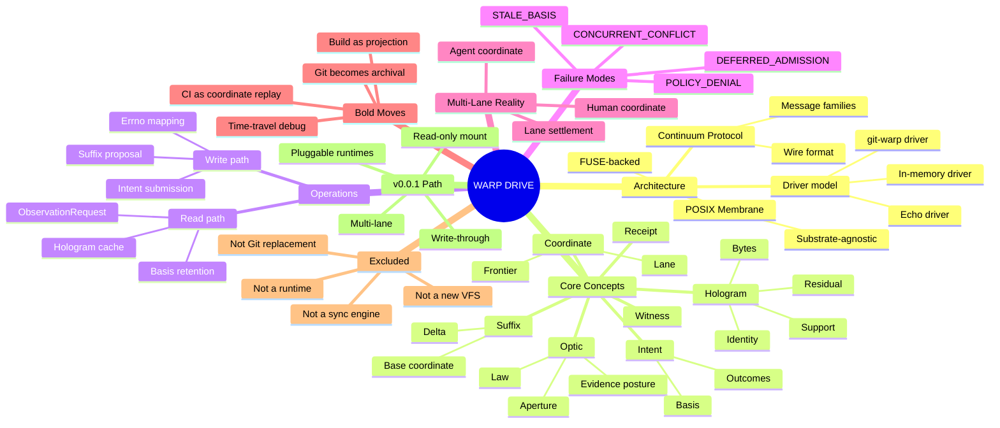
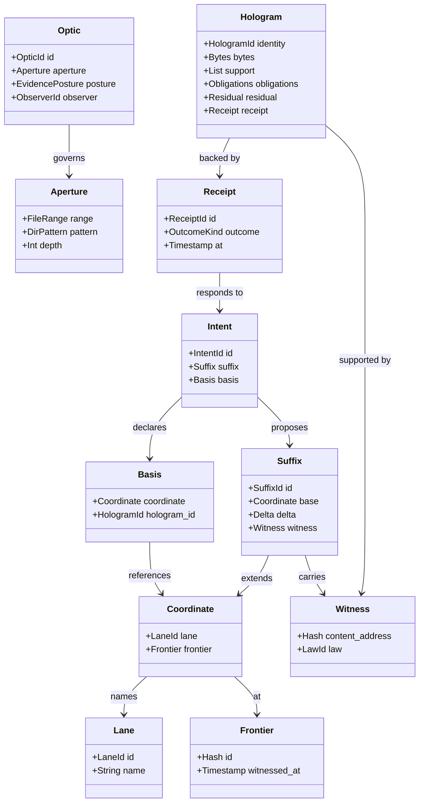
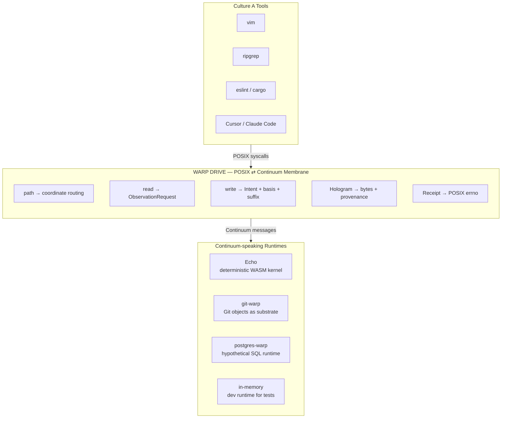
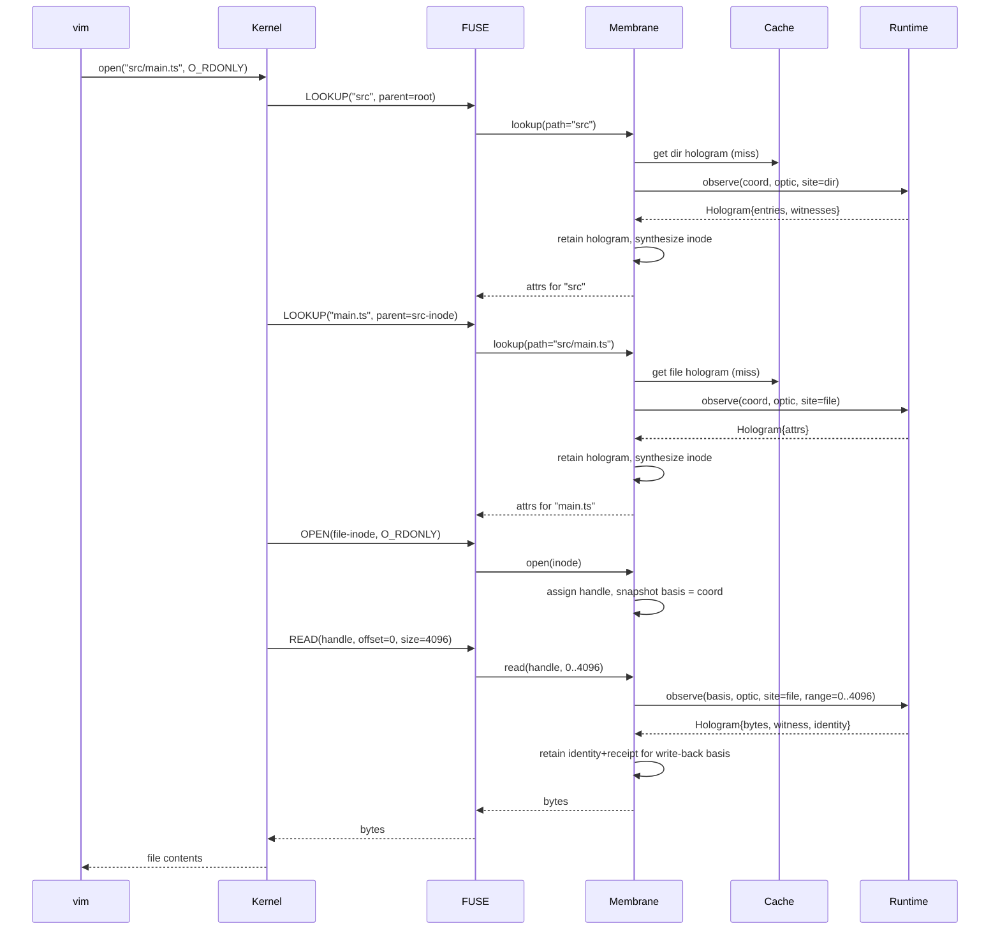
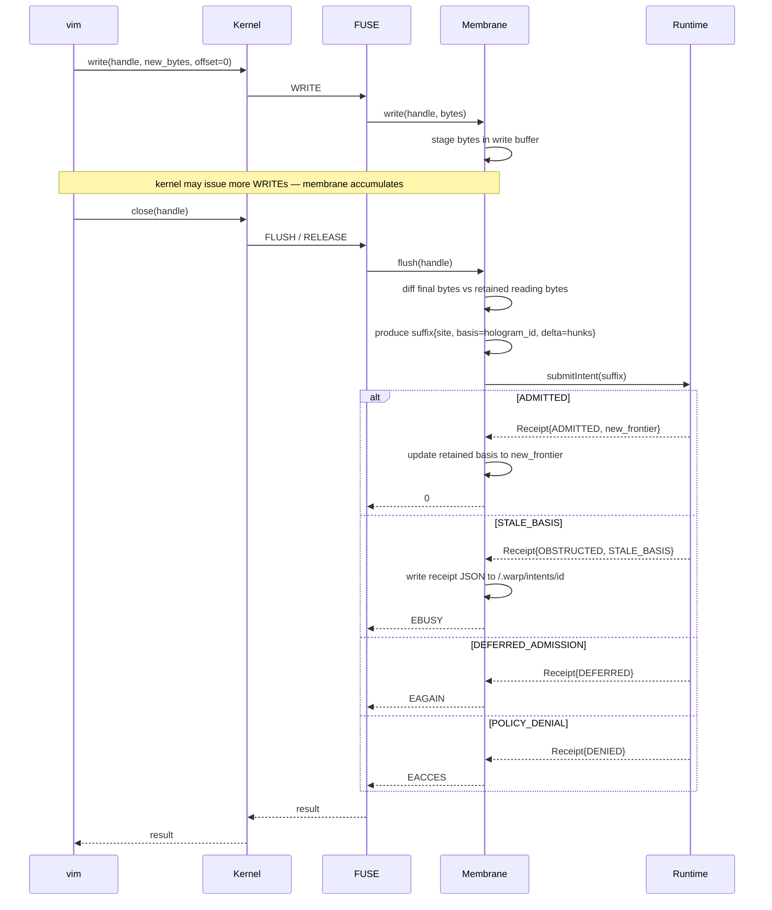
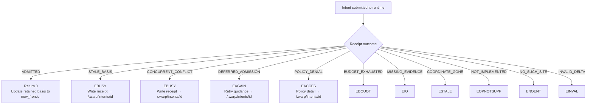
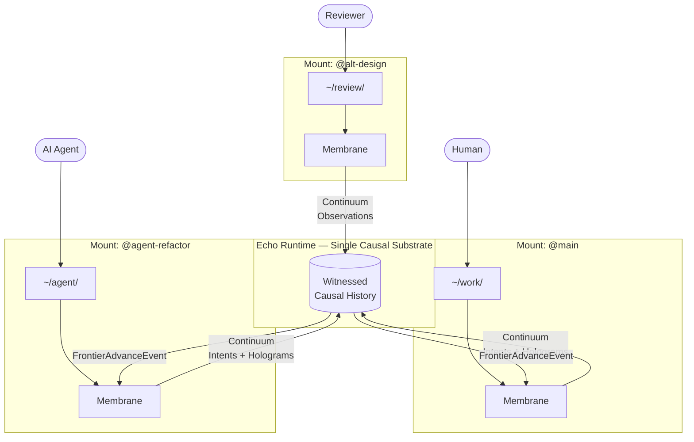
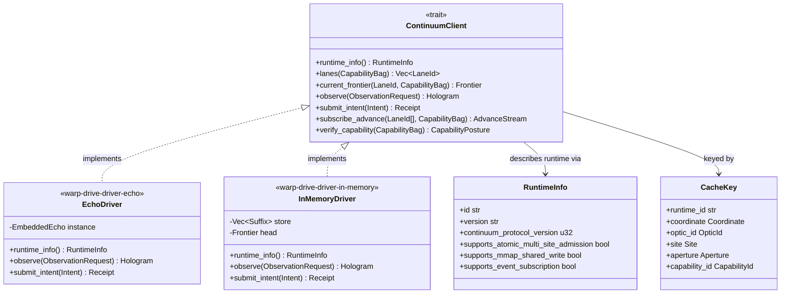

<!-- SPDX-License-Identifier: Apache-2.0 OR LicenseRef-MIND-UCAL-1.0 -->
<!-- © James Ross Ω FLYING•ROBOTS <https://github.com/flyingrobots> -->

# WARP DRIVE — Technical Deep Dive

> **A POSIX-shaped membrane over witnessed causal history.**
>
> You mount it. You get files. The files are not the truth — they are the
> latest lawful projection. Every read names a coordinate. Every write is a
> proposal against a basis. The substrate underneath is not a directory tree.
> It is the history of every admitted change, witnessed and addressable.
>
> This document assumes you have never heard of WARP, Echo, or Continuum.
> By the end, you will know enough to argue with it.

---

## Table of contents

1. [The pitch in one paragraph](#1-the-pitch-in-one-paragraph)
2. [Why this needs to exist](#2-why-this-needs-to-exist)
3. [Ten words you need](#3-ten-words-you-need)
4. [The substrate-agnostic claim](#4-the-substrate-agnostic-claim)
5. [What a mount looks like](#5-what-a-mount-looks-like)
6. [Anatomy of a read](#6-anatomy-of-a-read)
7. [Anatomy of a write](#7-anatomy-of-a-write)
8. [Failure modes as typed obstructions](#8-failure-modes-as-typed-obstructions)
9. [Multi-lane reality](#9-multi-lane-reality)
10. [The bold moves](#10-the-bold-moves)
11. [What WARP DRIVE is not](#11-what-warp-drive-is-not)
12. [A credible v0.0.1 path](#12-a-credible-v001-path)
13. [Open questions](#13-open-questions)
14. [Reference: the Continuum client surface](#14-reference-the-continuum-client-surface)

---

## System map



---

## 1. The pitch in one paragraph

`vim file.txt` opens a file. `:w` saves it. `ripgrep` walks the tree.
`eslint` reads source. Your build script writes `dist/`. Cursor and Claude
Code and GitHub Copilot all act on files.

Every one of those tools believes in the same model: **files are the truth,
saves overwrite truth, reads return the current truth.** That model is wrong
the moment you have two humans, or one human and one agent, or any system
that wants to know how the current bytes came to be the current bytes.

WARP DRIVE replaces that model in place. You still mount a directory. You
still get files. But underneath, the substrate is a witnessed causal history.
A read is an observation at a coordinate. A write is an Intent against a
basis. The same project can be mounted at two different coordinates
simultaneously — a human on one, an agent on another — without forking a
worktree, without losing provenance, without anyone's tools learning new
verbs.

Files become honest about what they are: **the most recent materialized
reading**, witnessed and revocable. The truth lives one layer below.

---

## 2. Why this needs to exist

Two cultures of tooling exist on every developer's machine.

**Culture A — files.** Posix, mtime, inotify, `O_TRUNC`, `rename(2)`,
`fsync`, `O_APPEND`. Every editor, every shell, every IDE, every linter,
every test runner, every container build. This culture is enormous and it is
not going anywhere. It is what humans and tools know.

**Culture B — causal substrates.** Event sourcing, append-only logs,
version-controlled stores, deterministic runtimes like [Echo][echo], graph
databases that record the history of every write, CRDT-backed collaborative
systems. This culture is small but growing, and it is right about something
important: **the current value is not enough information to reason about a
system honestly.** You need to know how it became the current value, who
witnessed that becoming, and what basis the writer believed they were
amending.

The two cultures don't talk to each other gracefully. The bridge today is
Git: humans commit, branch, merge, rebase, and the substrate is
content-addressed history. But Git is not mounted. You don't `cd` into a
commit. You check it out into a worktree, where it becomes files again,
where the substrate is forgotten until your next commit.

WARP DRIVE is the bridge that works the other direction: keep the substrate
live, project it through a POSIX-shaped aperture, let Culture A tools
operate without changing.

This is not a new VFS abstraction layer. It is not a new file model. It is a
specific compatibility membrane: **POSIX semantics for tools, causal
semantics for truth.**

[echo]: https://github.com/flyingrobots/echo

---

## 3. Ten words you need

These come from the WARP architecture frame that Echo and its sibling
runtimes share. Each one is small. Together they are enough to talk honestly
about what WARP DRIVE does.

### 3.1 WARP

The shape of all lawful causal computation in this family of systems:

```text
  bounded causal basis
+ law
+ observer aperture
+ support obligations
+ capability / budget / evidence posture
→ witnessed hologram
```

This is not a metaphor and it is not a programming model. It is a constraint
on what is allowed to count as "an operation." Every read, every write,
every fork, every observation, every materialization in a WARP system fits
this shape.

If a thing does not declare its basis, its law, its aperture, and its
obligations — it is not a WARP operation. It is a side effect.

### 3.2 Continuum

The HTTP-like protocol layer that lets independent WARP runtimes interoperate
without sharing implementation internals.

Continuum is **not** a runtime. It is a wire format and a set of message
families. A Continuum-speaking client (like WARP DRIVE) and a
Continuum-speaking server (like Echo, or git-warp, or any future runtime)
can exchange witnessed causal artifacts — suffixes, coordinates, optic
identifiers, support obligations, receipts — without either side knowing
how the other stores its history internally.

This is the layer that makes WARP DRIVE substrate-independent. See
[§4](#4-the-substrate-agnostic-claim).

### 3.3 Coordinate

"Where you are looking" in causal history. A coordinate names a **lane** (a
named line of causal evolution, similar to a branch but with stronger
identity) and a **frontier** within that lane (the leading edge of admitted
history, similar to a commit but with witness obligations).

Coordinates are not paths. A coordinate plus a path is what gives you bytes.

### 3.4 Optic

"How you are looking." An optic is a law-governed projection. It carries:

- which aperture is lawful (which slots, which fields, which file paths)
- which support must travel with the reading (so the reader can verify)
- which evidence posture is required (budget, freshness, redaction)
- which observer claims the reading (a human? an agent? a CI job?)

You cannot read causal history "directly." You read it through an optic.

### 3.5 Hologram

"What you got back." A hologram is the artifact a runtime emits when an
optic projects a coordinate. It is **not** a value. It is a witnessed,
law-named bundle containing:

- the bytes (or graph, or table — the materialized projection)
- the coordinate it was projected at
- the optic identity that produced it
- the support that backs it (refs to suffixes, witnesses, receipts)
- the identity of the reader and the budget consumed
- the residual / obstruction posture (what is missing, what was blocked)

A read in WARP DRIVE returns a hologram to the membrane. The membrane gives
the bytes to POSIX. The provenance is retained for the next operation.

### 3.6 Suffix

"A delta candidate." A suffix is a bundle of proposed additions to causal
history — what you want to admit. Suffixes have shape, witness, and a base
coordinate they claim to extend.

Every write in WARP DRIVE becomes a suffix proposal.

### 3.7 Intent

"A request to admit a suffix." An Intent carries the suffix bytes plus the
basis the writer believed they were extending. The runtime decides whether
to admit it. Outcomes are typed: admitted, obstructed, deferred, conflict,
denied.

### 3.8 Basis

"What you thought the world was when you proposed the change." A basis is
the coordinate (and optionally the hologram identity) that the writer
observed before producing the suffix.

If the world moved while you were typing, the basis is stale and the Intent
will be obstructed instead of silently applied to a different world. This is
the key invariant that makes lost updates impossible.

### 3.9 Witness

"Independent verifiable evidence." A witness is a signed, content-addressed
record that some event occurred under some law. Witnesses are how runtimes
prove to each other (over Continuum) that an admission really happened.

A WARP DRIVE read can demand witnesses for its hologram, and the membrane
will retain them. A subsequent observer can verify the reading without
trusting the membrane.

### 3.10 Receipt

"The runtime's response to an admission attempt." A receipt is the witnessed
outcome of an Intent. It tells the writer what happened, with enough
provenance for downstream tools to verify.

In POSIX terms: a receipt is what the membrane consults to decide whether
`write(2)` returns `0`, `EBUSY`, `EAGAIN`, `EACCES`, `EDQUOT`, or some other
typed failure.

### Concept relationships



---

## 4. The substrate-agnostic claim

> **WARP DRIVE will work against any runtime that speaks Continuum.**

This is the bold claim. It is true for a specific architectural reason:
WARP DRIVE is not an Echo client. It is a Continuum client. Echo is one of
several plausible Continuum-speaking runtimes.

Here is the layering:

```text
┌──────────────────────────────────────────────────────────────┐
│  Culture A tools: vim, ripgrep, eslint, build, Cursor, etc.  │
└──────────────────────────────────────────────────────────────┘
                            │ POSIX
                            ▼
┌──────────────────────────────────────────────────────────────┐
│  WARP DRIVE — POSIX ⇄ Continuum membrane                     │
│                                                              │
│  path → coordinate routing                                   │
│  read → observation request                                  │
│  write → Intent (delta + basis + suffix)                     │
│  hologram → bytes + provenance retention                     │
│  receipt → POSIX errno mapping                               │
└──────────────────────────────────────────────────────────────┘
                            │ Continuum
                            ▼
┌──────────────────────────────────────────────────────────────┐
│  Any Continuum-speaking runtime                              │
│                                                              │
│  - Echo (deterministic in-process WASM kernel)               │
│  - git-warp (Git objects as causal substrate)                │
│  - postgres-warp (hypothetical SQL-hosted runtime)           │
│  - s3-warp (hypothetical object-store runtime)               │
│  - in-memory dev runtime (for tests, no persistence)         │
└──────────────────────────────────────────────────────────────┘
```



The runtime swap is a config change. The membrane and the tools above it
don't know which runtime is underneath. They send Continuum messages and
receive Continuum responses; the runtime is responsible for everything else.

This matters for three reasons:

**Reason A — heterogeneous environments are normal.** A developer might
prefer git-warp locally (no daemon, fits an existing Git remote), CI might
prefer Echo (deterministic, hermetic), production might prefer postgres-warp
(durable, queryable from the outside). The same WARP DRIVE mount works
against all three. The same vim opens the same files. The substrate is an
operations choice, not a developer-experience choice.

**Reason B — substrates can evolve.** A team that starts on git-warp can
migrate to postgres-warp without re-teaching anyone how to edit code. The
migration is a runtime swap behind the membrane. The mount specification
changes; everything above the mount does not.

**Reason C — substrates can compose.** A single machine can mount one lane
backed by Echo (live runtime) and another lane backed by git-warp (the
archive of how that runtime got here). Both look like normal directories.
The user can `diff` between them. The membrane handles the translation.

The architectural cost of this claim is small: WARP DRIVE must not depend
on any single runtime's internals. It must speak Continuum and only
Continuum. This is enforced by separating the membrane code from any
runtime-specific code; the runtime-specific code lives in **drivers**, one
per substrate, each implementing a single trait. See
[§14](#14-reference-the-continuum-client-surface).

---

## 5. What a mount looks like

The user-facing surface is `mount(8)`-shaped. The expectation is FUSE-backed
on Linux/macOS, with a future native APFS/NTFS path possible. POSIX from
above; Continuum from below.

```bash
# Mount the main lane of a repo backed by an Echo runtime at a Unix socket.
mount -t warpdrive \
  -o runtime=echo,socket=/run/warp/echo.sock,coordinate=@main \
  warpdrive#repo /Users/me/project

# Mount the same repo at a different coordinate (an agent's working lane).
mount -t warpdrive \
  -o runtime=echo,socket=/run/warp/echo.sock,coordinate=@agent-refactor \
  warpdrive#repo /Users/me/agent-lane

# Mount a different repo from a git-warp substrate, read-only.
mount -t warpdrive \
  -o runtime=git-warp,repo=/srv/repos/old.git,coordinate=@v3.2.0,readonly \
  warpdrive#old /Users/me/historical
```

After mounting, the directories are usable from anything that opens files.
`ls`, `cat`, `vim`, `find`, `ripgrep`, `tree`, `git` (yes, you can run a
nested Git in there), `node`, `npm install`, `cargo build`, your IDE, your
agent.

What changed is what those operations mean.

### 5.1 Mount-time configuration

Every mount needs to answer four questions:

1. **Which runtime?** Identifies the driver (`echo`, `git-warp`,
   `postgres-warp`, etc.) and the connection (socket path, HTTP URL,
   database DSN, repo path).
2. **Which coordinate?** A lane plus a frontier policy. Common policies:
   - `@<lane>` — track the current frontier of `<lane>`, advancing as new
     suffixes are admitted.
   - `@<lane>:<frontier>` — pin to a specific frontier, never advance.
     Useful for time-travel debugging and historical audit.
   - `@<lane>:basis=read` — pin basis at read time per file (allows local
     edits against a stable basis even as the lane advances).
3. **Which optic policy?** Determines how reads project the coordinate
   into bytes:
   - `posix-default` — directories and files, mtime from receipts, modes
     from declared file metadata.
   - `posix-flat` — single virtual directory, useful for ID-addressed
     stores.
   - `custom://...` — a runtime-specific optic identifier (e.g., jedit's
     rope-projection optic for text buffers).
4. **Which capability bag?** Determines what writes are allowed.
   Capabilities are runtime-issued tokens; the membrane carries them on
   every Intent. Reads typically need only a default capability; writes
   may need stronger ones.

These four choices live in the mount options. They can change only by
remounting — the mount itself is the unit of policy.

### 5.2 What the user sees

A successful read-only mount looks like a normal directory:

```bash
$ ls -la /Users/me/project
total 24
drwxr-xr-x  6 me  staff   192 2026-05-28 14:00 .
drwxr-xr-x  4 me  staff   128 2026-05-28 14:00 ..
drwxr-xr-x  3 me  staff    96 2026-05-28 13:55 src
drwxr-xr-x  3 me  staff    96 2026-05-28 13:55 spec
-rw-r--r--  1 me  staff  1283 2026-05-28 13:55 README.md
-rw-r--r--  1 me  staff   420 2026-05-28 13:55 package.json
```

But the metadata is honest. Every `stat` field has a derivation:

- **mtime** — the receipt timestamp of the last suffix admitted at this
  file's site.
- **size** — the byte length of the projection at the current coordinate.
- **mode** — declared file metadata from the runtime, projected through
  the active optic.
- **inode** — synthesized; stable for the lifetime of the mount, but not
  meaningful across mounts. The substrate uses content + coordinate
  addresses, not inodes.

There is also a hidden control surface for tools that want to introspect
the substrate:

```text
/.warp/coordinate          # current coordinate as text
/.warp/runtime             # runtime identifier + connection summary
/.warp/holograms/<inode>   # provenance bundle for the last reading at <inode>
/.warp/intents/pending     # in-flight Intent identifiers
/.warp/intents/<id>        # receipt for a specific Intent
/.warp/lanes               # newline-separated list of lanes the runtime exposes
/.warp/witness/<oid>       # raw witness bytes for verifiers
```

This is a deliberate, named surface — not a leak. Tools that want to be
WARP-aware (Graft, jedit, etcwhich already know about coordinates and
optics) can read here. Tools that don't care can ignore `.warp/` entirely.

---

## 6. Anatomy of a read

A read in WARP DRIVE is an observation. Here is the full chain when `vim
src/main.ts` opens a file on a freshly mounted directory.

### 6.1 The chain

```text
1. vim → kernel: open("src/main.ts", O_RDONLY)
2. kernel → FUSE: LOOKUP("src", parent=root)
3. FUSE → WARP DRIVE: lookup request
4. WARP DRIVE: path "src" → coordinate-relative site
                          → check directory hologram cache (miss)
                          → emit ObservationRequest(coord, optic, site=dir)
5. WARP DRIVE → Continuum runtime: observe(request)
6. Runtime → WARP DRIVE: Hologram { entries: [...], witnesses: [...] }
7. WARP DRIVE: retain hologram, synthesize inode for "src"
8. FUSE → kernel: LOOKUP response with attrs
9. kernel → FUSE: LOOKUP("main.ts", parent=src-inode)
10. (steps 4-8 repeat for the file)
11. kernel → FUSE: OPEN(file-inode, O_RDONLY)
12. FUSE → WARP DRIVE: open request
13. WARP DRIVE: assign file-handle, snapshot basis = current coordinate
14. kernel → FUSE: READ(file-handle, offset=0, size=4096)
15. FUSE → WARP DRIVE: read request
16. WARP DRIVE: emit ObservationRequest(basis, optic, site=file, range=0..4096)
17. Runtime → WARP DRIVE: Hologram { bytes: <slice>, witness, identity }
18. WARP DRIVE: retain hologram (for write-back basis), return bytes
19. FUSE → kernel → vim: bytes arrive
```

Steps 5, 16 are the only places the membrane talks to the runtime. Steps
7, 13, 18 are where the membrane retains provenance — this is what enables
honest write-back later.



### 6.2 What's in an ObservationRequest

```text
ObservationRequest {
    coordinate:   <lane + frontier>
    optic:        <optic-id from mount policy>
    site:         <runtime-specific addressing for the slot>
    aperture:     <how much of the slot to project>
                  - file: { offset, length }
                  - directory: { entry-pattern, depth }
    capability:   <capability bag from mount>
    budget:       <max bytes, max cost, max latency>
    posture:      <freshness, redaction, support obligations>
}
```

Note what's not in there: a path. The membrane translates path-shaped
addresses into coordinate-shaped sites at lookup time. By the time we hit
the runtime, the path is no longer the question.

### 6.3 What comes back

```text
Hologram {
    identity:     <content-address + optic-id + coordinate-id>
    bytes:        <the projected slice>
    support:      <list of suffix-refs and witness-refs that back this>
    obligations:  <what the reader must retain to verify later>
    residual:     <what was elided, redacted, or blocked>
    receipt:      <runtime's receipt for the observation itself>
}
```

The membrane keeps `identity` and `receipt` in a per-file-handle table.
When the file is later written, the basis comes from this table — not
from "the current state of the world."

This is the key invariant: **the basis of a write is the basis of the
reads it was prepared against, not whatever the world looks like at write
time.**

### 6.4 Cache semantics

A naïve membrane that cached bytes by path would corrupt itself the moment
two mounts at different coordinates shared a cache, or the moment a
runtime admitted a suffix that shifted the projection. The cache key must
include enough to keep readings honest.

The minimum cache key is:

```text
(runtime-id, coordinate, optic-id, site, aperture, capability-id)
```

A cache entry is the hologram. Entries are invalidated when the runtime
emits a frontier-advance event that touches the cached site, or when the
mount's coordinate policy advances. The membrane subscribes to runtime
events for this; runtimes that don't push events fall back to TTL-based
revalidation.

A cache hit on the wrong key is a correctness bug. There is no "best
effort" cache here — if the key doesn't match, the entry is not legal to
serve.

---

## 7. Anatomy of a write

A write is the harder half. POSIX writes are imperative. Causal writes
are propositional. The membrane must translate one to the other without
lying to either side.

### 7.1 The chain

```text
1. vim → kernel: write(file-handle, <new contents>, offset=0)
2. kernel → FUSE → WARP DRIVE: write request
3. WARP DRIVE: stage bytes in per-handle write buffer
4. (kernel may issue more writes; membrane accumulates)
5. vim → kernel: close(file-handle) or fsync(file-handle)
6. kernel → FUSE → WARP DRIVE: flush/release
7. WARP DRIVE: gather final bytes, diff against retained reading bytes
8. WARP DRIVE: produce suffix candidate {
       site: <same site the read addressed>
       basis: <hologram identity from the read>
       delta: <hunks computed by diff>
       optic: <write-optic, derived from mount policy>
   }
9. WARP DRIVE → Continuum runtime: submitIntent(suffix-candidate)
10. Runtime processes the Intent, returns a Receipt
11. WARP DRIVE inspects receipt:
       - ADMITTED → success; update retained basis to new frontier
       - OBSTRUCTED → typed POSIX error (see §8)
       - DEFERRED → EAGAIN, with retry guidance in .warp/intents/<id>
       - CONFLICT → EBUSY, with conflict detail in .warp/intents/<id>
       - DENIED → EACCES, with policy detail in .warp/intents/<id>
12. WARP DRIVE returns the appropriate result to FUSE → kernel → vim
```



### 7.2 Where the basis comes from

Step 8 hinges on the basis. WARP DRIVE took the basis from the read. The
diff is computed against the bytes the reader was shown — not against
"what's currently in the file," because there is no such thing as
"currently in the file" at the substrate layer.

This means: if another writer admitted a suffix at the same site between
your read and your write, **your write does not silently overwrite theirs.**
The runtime sees a basis that no longer matches the current frontier, and
the Intent is obstructed. The membrane returns `EBUSY` or `EAGAIN` to vim,
which signals the user honestly that the world moved.

This is the inverse of how filesystems normally work. Normally, the last
writer wins. Under WARP DRIVE, **the only writer that wins is one whose
basis is still current** — every other writer is told their basis is
stale, with enough detail to reconcile.

### 7.3 What if the file is new?

`creat(2)` and `open(O_CREAT)` produce a site that does not yet exist at
the coordinate. The membrane treats this as a "create site" Intent — a
suffix whose delta is `(absent → bytes)`. The runtime decides whether
that's allowed (the optic's create policy says yes or no).

### 7.4 What about `rename(2)`?

Rename is the hardest POSIX primitive because it must be atomic across two
sites. The membrane packages rename as a single Intent containing two
delta hunks: `(old-site → absent)` and `(new-site → bytes)`. The runtime
admits both or neither. If the runtime cannot guarantee atomic two-site
admission, the membrane refuses the rename with `EOPNOTSUPP` rather than
faking it.

This is a real constraint on what runtimes can host WARP DRIVE. Continuum
must declare whether multi-site atomic admission is supported by a given
runtime, and the membrane caps user expectations accordingly.

### 7.5 What about `mmap`?

`mmap` is read-only and copy-on-write only in the first version. Shared
writable mappings are not implementable honestly without lying about
durability — the kernel expects writes to a shared mapping to become
visible to other readers, which requires substrate-level shared mutable
state that WARP DRIVE deliberately does not have. The membrane returns
`ENODEV` for `MAP_SHARED | PROT_WRITE`.

This is a real limitation. Some tools (e.g., SQLite in default mode) won't
work on a WARP DRIVE mount. The compatibility surface is "most editors and
most tools," not "all POSIX in all modes."

---

## 8. Failure modes as typed obstructions

A central design choice: **WARP DRIVE never returns a generic error.**
Every failure has a typed cause from the runtime, mapped to a POSIX errno
that matches its semantics, with detail available under `/.warp/intents/`.

### 8.1 The mapping

| Runtime obstruction | POSIX errno | Meaning |
|---|---|---|
| `STALE_BASIS` | `EBUSY` | The world moved between your read and your write. |
| `CONCURRENT_CONFLICT` | `EBUSY` | Another writer admitted a competing suffix. |
| `DEFERRED_ADMISSION` | `EAGAIN` | The runtime can't decide synchronously; retry later. |
| `POLICY_DENIAL` | `EACCES` | The optic/capability does not allow this. |
| `BUDGET_EXHAUSTED` | `EDQUOT` | The read or write exceeded the declared budget. |
| `MISSING_EVIDENCE` | `EIO` | The runtime expected a witness it could not provide. |
| `COORDINATE_GONE` | `ESTALE` | The coordinate the mount tracks no longer exists. |
| `NOT_IMPLEMENTED` | `EOPNOTSUPP` | The runtime doesn't support this operation. |
| `NO_SUCH_SITE` | `ENOENT` | The address doesn't name a slot at this coordinate. |
| `INVALID_DELTA` | `EINVAL` | The write was structurally incoherent. |



### 8.2 Detail surface

Every Intent has an id. Receipts are written to
`/.warp/intents/<id>` as JSON, so a tool that gets `EBUSY` from `:w` can
inspect what actually happened:

```json
{
  "id": "01HZX2J7P3KQE6V9NHTW4M5RBA",
  "outcome": "OBSTRUCTED",
  "reason": "STALE_BASIS",
  "basis_held": { "coordinate": "@main", "frontier": "fr:1a2b..." },
  "basis_current": { "coordinate": "@main", "frontier": "fr:8c9d..." },
  "advancing_suffixes": [
    { "id": "sx:7e6f...", "by": "agent-1", "at": "2026-05-28T14:32:11Z" }
  ],
  "recovery": "RE_READ_AND_REPROPOSE"
}
```

Editors that want to be WARP-aware can teach themselves to read this file
and offer the user a real choice ("re-read the file and try again? show
the diff between your version and the advancing version?") instead of the
useless "save failed."

Tools that don't care just see `EBUSY` and move on. The user can still
inspect `/.warp/intents/last` manually.

### 8.3 Why this matters

The honest failure mode of a causal substrate under concurrent edit is
**negotiation**, not data loss. Today's filesystems handle the same
scenario by silently letting one writer's bytes win. WARP DRIVE refuses
to do that. The cost is real: tools that don't know how to negotiate
will see more error returns than they expect. The benefit is also real:
lost updates become structurally impossible.

This is a deliberate trade. It is the central trade.

---

## 9. Multi-lane reality

This is where WARP DRIVE gets fun.

### 9.1 The setup

```bash
# Human is working on the main lane.
mount -t warpdrive -o runtime=echo,coord=@main /repo  ~/work

# An AI agent is working on a refactor lane derived from main.
mount -t warpdrive -o runtime=echo,coord=@agent-refactor /repo  ~/agent

# A reviewer is browsing a third lane that proposes a different approach.
mount -t warpdrive -o runtime=echo,coord=@alt-design /repo  ~/review
```



Three directories. Same repo, same substrate, three coordinates. No
worktrees. No `git checkout -b`. No filesystem juggling.

The human edits `~/work/src/main.ts`. Their write becomes a suffix at
`@main`. The agent's view at `~/agent/src/main.ts` doesn't see it until
the agent's lane chooses to advance — because the agent's lane is its own
coordinate, and lane advance is an explicit causal operation.

The agent can ask the runtime, via a Continuum admission, to **rebase
its lane onto the new `@main` frontier**, which is a substrate-native
operation — not a text-level rebase. The substrate knows what suffixes
each lane has, and can recombine them under law.

### 9.2 What this enables

- **No "stash your changes before pulling."** Your changes are on your
  lane. Pulls advance your lane against another lane under explicit
  causal law.
- **No "the agent overwrote my work."** The agent is on its own
  coordinate. Its writes don't touch yours until a lane operation
  combines them.
- **No "checkout-and-rebuild" overhead.** Switching coordinates is a
  remount, which is cheap. The runtime stays warm; only the membrane's
  routing changes.
- **No "what version was running when this bug happened."** Mount the
  historical coordinate. The bytes that were live at the time of the
  bug are what you see. Re-run the test against the same coordinate
  the bug ran on.
- **Distributed teams operate on lanes, not branches.** A lane has a
  witness trail; a branch is a name attached to a hash. The first
  composes; the second concatenates.

### 9.3 The agent collaboration story

This is the cool part.

Today, a coding agent operates in one of two modes. Mode 1: it operates
on the same working directory as the human, and they take turns. Mode 2:
the agent operates in a worktree or container, then the human reviews a
diff.

Mode 1 is a constant source of stomping. Mode 2 is high-latency and loses
context (the agent doesn't see the human's in-progress thoughts).

WARP DRIVE offers Mode 3: **the agent and human are on adjacent
coordinates, both live, both writeable, with substrate-level merge
semantics.** The agent's edits don't stomp because they're on a different
lane. The human can see what the agent is doing in real time by `cat`ing
files on the agent's mount. When the work is ready, a lane settlement
operation combines them with full causal provenance — including who wrote
what, when, on which basis, and what the obstruction history looked like.

This is not a UI dream. It is what the architecture already supports as
soon as the membrane is real.

---

## 10. The bold moves

If WARP DRIVE works, several things that look like fixed costs of software
development become optional.

### 10.1 Git becomes archival, not authoritative

Git's role today is split: it is the substrate of truth, the transport, the
archive, the audit trail, and the collaboration protocol. WARP DRIVE
collapses substrate-of-truth into the Continuum runtime; transport into
Continuum suffix exchange; collaboration into lane settlement.

Git remains useful as **content-addressed archive** (the runtimes can
write retained holograms to a Git remote for cold storage) and as
**interop with the legacy world** (Git remotes can be exported from a
WARP DRIVE mount, for tools that have not learned to speak Continuum yet).

But `git pull`, `git push`, `git merge`, `git rebase`, `git stash`, `git
worktree`, `git cherry-pick` — every one of those becomes a lane
operation on the substrate, with the membrane translating only for tools
that still need Git's CLI shape.

### 10.2 CI becomes coordinate replay, not container rebuild

A CI job today is a script that boots a fresh container, clones a repo at
a commit, installs dependencies, runs tests. The bulk of the cost is
not the test — it is reaching the state where the test can run.

A WARP DRIVE CI job mounts the substrate at the coordinate under test.
The dependencies are already there as projections. The build artifacts
from the last test run at the parent coordinate are already there as
projections. The new test runs against a delta, not a rebuild.

The unit of CI shifts from "container per commit" to "coordinate per
proposal." Cache hit rates approach 100% because the cache key includes
the coordinate, not a brittle hash of inputs.

### 10.3 Build artifacts become projections

A `dist/` directory under WARP DRIVE is not a place where build output
goes. It is an optic that projects source coordinates through a build law
into output bytes. When the source coordinate advances, the dist
projection invalidates lazily, and the next reader of a dist file gets
the up-to-date projection — without `npm run build` being a thing the
human types.

The build "happens" because somebody asked for the bytes. It does not
"happen" because somebody ran a command.

This requires the runtime to host a build optic, which is non-trivial.
But the architecture supports it; the work is implementation.

### 10.4 Time-travel debugging at the filesystem layer

Mount a coordinate from yesterday. `cd` into it. Run the failing test.
The bytes you see are the bytes that ran when the test originally failed.
The runtime can replay the substrate forward to any later coordinate to
see how the bug was eventually fixed — or to step through the suffixes
that introduced it.

`git bisect` becomes coordinate-walking. The walking happens in the
membrane; the human sees only files at different coordinates, each one a
real navigable directory.

### 10.5 The codebase is the same across runtimes

A dev runs WARP DRIVE against an in-memory runtime for fastest iteration.
CI runs against Echo for determinism. Staging runs against git-warp for
cheap operations. Production runs against postgres-warp for queryability.

The same repository works on all four. The mount config changes; nothing
above the mount does. The substrate is no longer the thing developers
pick; it is the thing operators pick.

### 10.6 AI agents have a real protocol for shared work

Today, multi-agent collaboration is a thicket of file-locking heuristics
and "let's not have two agents touch the same file." WARP DRIVE gives
agents the same coordinate model humans get: each agent has a lane, each
lane has a frontier, each write declares its basis. The negotiation is
algorithmic and the substrate refuses to lose work.

This is the closest thing to a "git for AI agents" that doesn't require
rebuilding the entire developer experience around a new tool. Agents use
files. WARP DRIVE turns those files into negotiated proposals.

---

## 11. What WARP DRIVE is not

A surprising amount of design clarity comes from naming what something is
deliberately not.

### 11.1 Not a runtime

WARP DRIVE has no substrate. It does not store history. It does not admit
suffixes itself. It cannot be the only thing in a deployment. It is a
client.

### 11.2 Not a Git replacement

Git remains useful for transport and archive. WARP DRIVE replaces Git's
role as authoritative substrate of working files, but does not replace
Git's role as content-addressed exchange. A WARP DRIVE setup that wants
to integrate with the global open-source ecosystem will still push Git
remotes; those remotes will be projections from a runtime, not the
source of truth.

### 11.3 Not a new VFS abstraction

WARP DRIVE does not invent a new file model. It exposes POSIX. It does
not extend POSIX with new syscalls. Tools that work on POSIX work on
WARP DRIVE. The exotic surface is `.warp/` and the typed errnos, and
neither is required.

### 11.4 Not a sync engine

A sync engine moves bytes around to make multiple machines agree on
"current state." WARP DRIVE has no notion of "current state" worth
syncing — the truth is the witnessed history, which is what the runtime
already exchanges via Continuum. The membrane does no syncing of its own.

### 11.5 Not magic

If the underlying runtime can't admit a write (no capability, stale
basis, policy denial), the write fails. If the runtime is down, the
membrane returns `EIO` honestly. If the runtime is slow, reads are slow.
There is no caching layer that pretends the runtime is faster than it
is.

The membrane's job is to translate cleanly, not to hide the substrate.

---

## 12. A credible v0.0.1 path

Four steps. Each one is shippable; each one earns the next.

### Step 1 — Read-only mount against a single runtime (Echo)

Smallest useful thing. A FUSE binary that:

- Takes a single coordinate at mount time
- Implements `LOOKUP`, `GETATTR`, `OPEN`, `READ`, `RELEASE`, `READDIR`
- Talks to Echo over its existing observation request surface
- Caches holograms with the cache key from §6.4
- Exposes `.warp/coordinate` and `.warp/runtime` as text files

After Step 1: you can `cat`, `ls`, `grep`, and open with read-only tools.
No writes. No remounts. One runtime.

This proves the read-path translation works end-to-end and that the
performance is plausible (within ~2x of a real filesystem on a warm
cache).

### Step 2 — Write-through with basis-tracking

Add `CREATE`, `WRITE`, `FLUSH`, `RELEASE` for writes, `UNLINK`, `RENAME`.

- Reads continue to retain basis
- Writes diff against retained basis
- Intents go to Echo; receipts map to typed errnos
- `.warp/intents/<id>` exposes receipt JSON

After Step 2: vim works. So does `npm install`. Rename is the hard part;
fall back to `EOPNOTSUPP` if the runtime can't promise atomic two-site
admission, and document the constraint.

### Step 3 — Multi-lane on the same machine

Allow two mounts of the same runtime at different coordinates
simultaneously. Each mount has independent cache state. Cross-mount
operations (e.g., `cp ~/work/file ~/agent/file`) are real — the bytes
flow through user space.

After Step 3: humans and agents can collaborate on adjacent coordinates.
The lane-settlement story is now demonstrable.

### Step 4 — Pluggable runtimes via Continuum

Extract the Echo-specific code into a driver. Define the Continuum client
trait. Add a second driver (most plausible: in-memory dev runtime, because
it's the easiest to write and the most useful for testing). Optionally
add a git-warp driver.

After Step 4: the substrate-agnostic claim is real, not theoretical. The
config-level swap is demonstrable.

### Out of scope for v0.0.1

- Build-artifact projections (Step 10.3)
- Time-travel debugging tooling (Step 10.4)
- A daemon for serving multiple mounts efficiently (likely a v0.0.2 thing)
- Performance work beyond "within 2x of real filesystem"
- macOS support beyond "uses macFUSE if available"
- Windows support at all

---

## 13. Open questions

The honest list of things this deep dive does not yet resolve.

### 13.1 How fast is a `stat` cycle?

Editors stat files constantly. ripgrep walks trees. A naïve implementation
could be 100x slower than ext4. The cache is essential; the cache key is
unforgiving. Real measurements needed before claiming "within 2x."

### 13.2 How does a directory with a million files materialize?

Every `readdir` is an observation. The hologram for a giant directory
could be enormous. Probable answer: directory observations are paginated
via aperture, and the membrane caches by page. But this needs design.

### 13.3 What does `inotify` mean?

`inotify` watchers expect to be notified when files change. Under WARP
DRIVE, "the file changed" means "the coordinate advanced and the
projection at this site changed." The membrane can subscribe to runtime
events and synthesize `inotify` events accordingly. Latency and
fan-out characteristics are open.

### 13.4 How does `O_APPEND` work?

`O_APPEND` says "every write goes at the current end of the file." Under
a causal substrate, "the current end" is a moving target. Probable
answer: `O_APPEND` writes always Intent against the latest basis the
membrane has seen for that file, and the receipt may obstruct if the
basis is stale. This means `echo "foo" >> log.txt` may need to retry.
This needs to be documented.

### 13.5 How are large files handled?

A 4GB binary projected through an optic isn't free. Probable answer:
holograms can stream — the runtime emits chunks under an aperture-bounded
budget, and the membrane serves `READ` requests against the stream. But
the implementation is non-trivial and the cache strategy gets harder.

### 13.6 What's the security story for `.warp/`?

`/.warp/witness/<oid>` exposes signed witnesses. Some of those witnesses
could carry sensitive provenance. The mount needs a capability-aware
view of `.warp/`, gated on the same capability bag that gates writes.
Default-deny if the question can't be answered honestly.

### 13.7 Can the membrane be a daemon?

For multiple mounts on one machine, a single daemon hosting one or more
runtime drivers makes more sense than one process per mount. But the
daemon adds operational complexity (config, lifecycle, restarts under
load) and the v0.0.1 path stays simpler if each mount is its own
process. The daemon is probably the right shape by v0.1.

### 13.8 What about Windows?

FUSE on Windows exists (Dokany, WinFsp). The translation is real but
worth a separate design pass; FUSE semantics and WinFsp semantics
diverge in places (especially around case sensitivity and reparse
points). Defer to v0.2.

---

## 14. Reference: the Continuum client surface

What the membrane actually needs from a runtime, expressed as a trait. Any
runtime that implements this trait can host WARP DRIVE.

This is sketched in Rust syntax for concreteness; the wire form is
Continuum messages (LE binary envelopes per Echo's current Continuum
implementation, or whatever the wire format settles on).

```rust
/// A driver that lets WARP DRIVE talk to a Continuum-speaking runtime.
///
/// All methods are async because real runtimes are remote-capable. The
/// in-memory dev runtime simply resolves synchronously.
trait ContinuumClient: Send + Sync {
    /// Identify the runtime (for `.warp/runtime` and logging).
    fn runtime_info(&self) -> RuntimeInfo;

    /// List lanes the runtime exposes. Used for `.warp/lanes`.
    async fn lanes(&self, capability: &CapabilityBag) -> Result<Vec<LaneId>, RuntimeError>;

    /// Resolve a lane name to a current frontier. The result is good for
    /// the lifetime of one observation cycle; callers must re-resolve
    /// for fresh reads.
    async fn current_frontier(
        &self,
        lane: &LaneId,
        capability: &CapabilityBag,
    ) -> Result<Frontier, RuntimeError>;

    /// Project a coordinate through an optic into a hologram. This is
    /// the read primitive.
    async fn observe(
        &self,
        request: ObservationRequest,
    ) -> Result<Hologram, RuntimeError>;

    /// Submit a suffix candidate as an Intent. Returns the runtime's
    /// receipt synchronously when possible; receipts may be deferred.
    async fn submit_intent(
        &self,
        intent: Intent,
    ) -> Result<Receipt, RuntimeError>;

    /// Subscribe to frontier-advance events for a set of lanes. The
    /// membrane uses this to invalidate caches and synthesize
    /// `inotify` events. Returns a stream the membrane drives.
    async fn subscribe_advance(
        &self,
        lanes: &[LaneId],
        capability: &CapabilityBag,
    ) -> Result<AdvanceStream, RuntimeError>;

    /// Capability check. The membrane calls this at mount time to
    /// confirm the supplied capability bag is valid; it caches the
    /// result for the mount lifetime.
    async fn verify_capability(
        &self,
        capability: &CapabilityBag,
    ) -> Result<CapabilityPosture, RuntimeError>;
}

/// What the runtime tells the world about itself.
struct RuntimeInfo {
    id: &'static str,           // "echo", "git-warp", "postgres-warp", ...
    version: &'static str,
    continuum_protocol_version: u32,
    supports_atomic_multi_site_admission: bool,
    supports_mmap_shared_write: bool,    // always false in v1 surface
    supports_event_subscription: bool,
}

/// The cache key tuple from §6.4 lives here too.
#[derive(Hash, Eq, PartialEq, Clone)]
struct CacheKey {
    runtime_id: &'static str,
    coordinate: Coordinate,
    optic_id: OpticId,
    site: Site,
    aperture: Aperture,
    capability_id: CapabilityId,
}
```



### 14.1 What this trait does NOT include

- No direct file/path operations. The membrane translates paths to sites
  before calling the runtime. The runtime never sees a path.
- No mtime, size, or POSIX metadata. Those are derived in the membrane
  from receipt timestamps, hologram lengths, and optic-declared metadata.
- No directory tree primitive. Directories are an optic — `ReadDir` is
  modeled as `observe()` with a directory aperture.
- No transaction. Multi-suffix atomic admission is requested by bundling
  multiple deltas into one Intent; the runtime declares whether it can
  honor that via `RuntimeInfo`.
- No notion of "the current state." Every read names a coordinate.

### 14.2 What a driver implementation looks like

The Echo driver wraps Echo's existing WASM kernel ABI (LE binary EINT
envelopes, observation requests, suffix admission). About 500-800 lines
of Rust to implement the full trait against Echo.

The git-warp driver wraps git-warp's Git-object-backed history. Frontiers
are commits; suffixes are trees of proposed objects; admission is a
fast-forward attempt with witness signing. Likely 1000-1500 lines.

The in-memory dev driver is purely for testing and local iteration:
suffixes accumulate in a Vec, frontier is the head of the Vec, every
admission succeeds. About 200 lines. Useful as a reference implementation
of the trait.

A hypothetical postgres-warp driver would map lanes to schemas, suffixes
to rows in a write-ahead table, admission to a transactional commit.
Estimated 1500-2500 lines. Has never been built; included here to make
the substrate-agnostic claim concrete rather than abstract.

---

## Closing

WARP DRIVE is not built. The above is what would be there if it were
built, with the architectural commitments that make it worth building at
all.

The core bet is that **POSIX is too useful to abandon and causal substrates
are too valuable to keep hidden behind clones and worktrees.** The
membrane is small enough to be worth writing and important enough that the
right people may want to write it.

If you read this far and you want to argue with it: please do. The seams
in [§13](#13-open-questions) are the most fertile. The bold moves in
[§10](#10-the-bold-moves) are the most worth attacking. The substrate-
agnostic claim in [§4](#4-the-substrate-agnostic-claim) is the load-
bearing wall — if it doesn't hold, the rest of the document is decoration.

The next step from here is a v0.0.1 plan with names against the four
steps in [§12](#12-a-credible-v001-path), and a runtime — Echo is the
obvious first — to point the read-only mount at.
